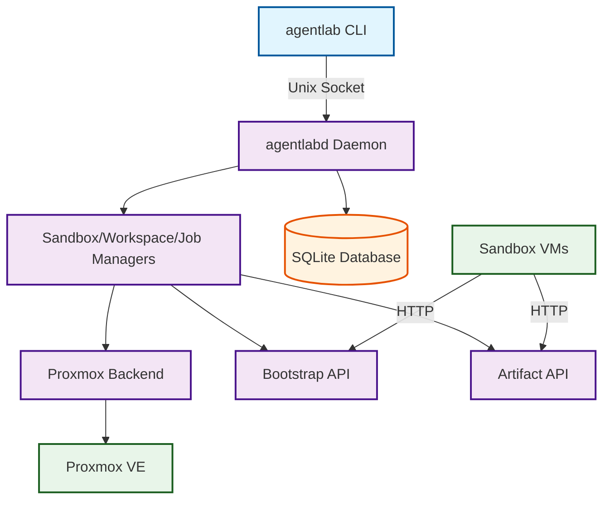
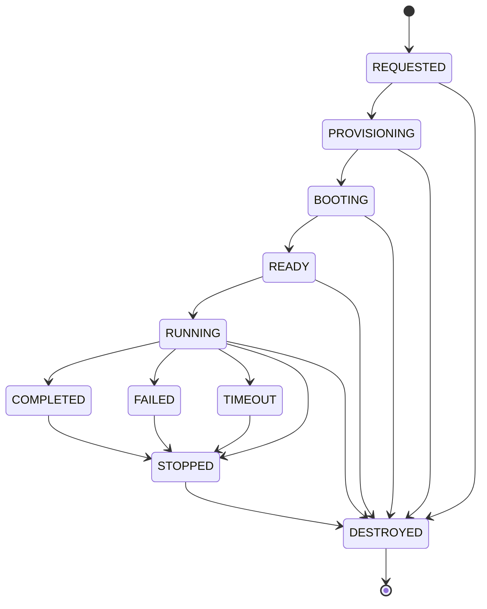

# AgentLab: Proxmox Sandbox & Job Orchestration

AgentLab is a production-ready sandbox orchestration system for Proxmox VE, enabling automated VM provisioning, job execution, workspace management, and artifact collection. Built with Go, it provides a daemon (`agentlabd`) and CLI (`agentlab`) for seamless sandbox lifecycle management.

## Overview

AgentLab provisions unattended, network-isolated VM sandboxes on Proxmox VE for running AI coding agents in "dangerous"/YOLO mode with full API-based infrastructure integration.

**Key components:**
- `agentlabd` daemon on Proxmox host (owns Proxmox access, enforces policy)
- `agentlab` CLI for local control via a Unix socket
- Proxmox API backend (recommended) or shell backend (fallback)
- Guest `agent-runner` service inside VM template for bootstrap + execution

**Security posture by default:**
- Full outbound Internet access with RFC1918/ULA egress blocks
- No host bind mounts; optional persistent workspaces via separate disks
- One-time secrets delivery into tmpfs only
- Host-owned exposures (Tailscale Serve) with audit events for every expose/unexpose
- API token authentication instead of shell access

### Network Modes

Profiles can set `network.mode` to one of `off`, `nat` (default), or `allowlist`. AgentLab maps these modes to Proxmox firewall groups and enables the firewall automatically:
- `off` -> `agent_nat_off` (no network)
- `nat` -> `agent_nat_default` (NAT + RFC1918/ULA blocks)
- `allowlist` -> `agent_nat_allowlist` (egress allowlist rules)

Ensure the firewall groups exist in Proxmox before using non-default modes.

## Prerequisites

- Proxmox VE 9.x+ host (API backend) or 8.x+ (shell backend)
- Storage pool suitable for templates/clones (ZFS or LVM-thin recommended)
- `vmbr0` for LAN/WAN and ability to create `vmbr1` for agent subnet (defaults to `10.77.0.0/16`)
- Go 1.24.0 or higher to build binaries (Go toolchain will auto-download if needed)
- Tailscale on the host for remote SSH access (recommended)
- Template VM with qemu-guest-agent enabled

## Quickstart (host setup)

1) Build binaries:

```bash
make build
```

2) Install binaries + systemd unit:

```bash
sudo scripts/install_host.sh
```

3) Configure networking (agent bridge + NAT/egress blocks):

```bash
sudo scripts/net/setup_vmbr1.sh --apply
sudo scripts/net/apply.sh --apply
```

4) (Recommended) Enable Tailscale subnet routing:

```bash
sudo scripts/net/setup_tailscale_router.sh --apply
```

 5) Create Proxmox API token and configure:

```bash
# Create API token
pveum user token add root@pam agentlab-api --privsep=0

# Configure /etc/agentlab/config.yaml with:
# proxmox_backend: api
# proxmox_api_url: https://localhost:8006
# proxmox_api_token: root@pam!agentlab-api=<token-uuid>
```

6) Create secrets and minimal config/profile, then build the template:

```bash
sudo scripts/create_template.sh
sudo systemctl restart agentlabd.service
```

7) Check control-plane status:

```bash
agentlab status
```

8) Run a job from the host:

```bash
agentlab job run --repo <git-url> --task "<task>" --profile yolo-ephemeral
```

For full operator setup, see the runbook below.

## Documentation

- **Architecture Diagrams**: `docs/architecture.md` - Comprehensive system architecture, state machines, and data flow diagrams
- Runbook: `docs/runbook.md`
- Secrets bundles: `docs/secrets.md`
- Local control API: `docs/api.md`
- Troubleshooting: `docs/troubleshooting.md`

## Architecture Overview



**For detailed architecture diagrams including:**
- Complete system architecture with all components
- Sandbox state machine with all transitions
- Network topology and security rules
- Job execution data flow
- Database schema and relationships
- Request lifecycle and error handling

See [docs/architecture.md](docs/architecture.md)

## Sandbox States



| State | Description | Allowed Operations |
|--------|-------------|-------------------|
| REQUESTED | VM creation requested | show, logs |
| PROVISIONING | VM being created | show, logs |
| BOOTING | VM is booting | show, logs |
| READY | VM ready but not running | show, logs, destroy |
| RUNNING | VM actively running | show, logs, destroy, lease renew |
| STOPPED | VM stopped | show, logs, start, destroy |
| TIMEOUT | Lease expired, VM may be gone | show, logs, destroy (--force) |
| DESTROYED | VM destroyed | show |
| FAILED | VM provisioning failed | show, logs |

**Notes:**
- Use `--force` with `sandbox destroy` to bypass state restrictions
- Use `sandbox prune` to remove orphaned TIMEOUT sandboxes
- Lease renewal only allowed in RUNNING state

## Proxmox Backend Configuration

AgentLab supports two Proxmox backends:

### API Backend (Recommended)

**Benefits:**
- More reliable than shell commands
- Better error handling and debugging
- No Proxmox IPC layer issues
- Standard HTTP authentication
- Future-proof (Proxmox recommended approach)

**Configuration:**

```yaml
proxmox_backend: api  # Use API backend (recommended)
proxmox_api_url: https://localhost:8006
proxmox_api_token: root@pam!token-id=token-uuid
proxmox_node: ""  # Auto-detected if empty
```

**Creating API Token:**

```bash
# Create API token for AgentLab
pveum user token add root@pam agentlab-api --privsep=0

# Output will show:
# full-tokenid: root@pam!agentlab-api
# value: 0d08f8bc-0a12-4072-8f18-264a33793bb9

# Add to config
proxmox_api_token: root@pam!agentlab-api=0d08f8bc-0a12-4072-8f18-264a33793bb9
```

**Testing API Backend:**

```bash
# Test API connectivity
curl -k -H "Authorization: PVEAPIToken=root@pam!token=uuid" \
  https://localhost:8006/api2/json/nodes

# Check template VM
curl -k -H "Authorization: PVEAPIToken=root@pam!token=uuid" \
  https://localhost:8006/api2/json/nodes/<node>/qemu/9000/config
```

### Shell Backend (Fallback)

**Use cases:**
- Proxmox API not available
- Legacy Proxmox versions
- Troubleshooting

**Configuration:**

```yaml
proxmox_backend: shell  # Use shell commands (qm, pvesh)
```

**Note:** Shell backend may encounter Proxmox IPC issues (e.g., `ipcc_send_rec[1] failed`).

## CLI Usage

### Global Flags

```bash
agentlab [global flags] <command> [command flags]

Global flags:
  --socket PATH   Path to agentlabd socket (default: /run/agentlab/agentlabd.sock)
  --json          Output JSON format
  --timeout       Request timeout (e.g., 30s, 2m)
```

### Sandbox Management

#### List Sandboxes

```bash
agentlab sandbox list

# JSON output
agentlab sandbox list --json
```

Output:
```
VMID  NAME          PROFILE         STATE    IP           LEASE
1020  test-api      yolo-ephemeral  RUNNING   10.77.0.130  2026-02-02T07:34:40Z
```

#### Create Sandbox

```bash
agentlab sandbox new \
  --profile yolo-ephemeral \
  --name my-sandbox \
  --ttl 10m

# With modifiers (resolved to a profile name like secure-small)
agentlab sandbox new \
  --name my-sandbox \
  --ttl 10m \
  +small +secure

# With workspace
agentlab sandbox new \
  --profile yolo-ephemeral \
  --name my-sandbox \
  --ttl 10m \
  --workspace my-workspace

# With specific VMID (advanced)
agentlab sandbox new \
  --profile yolo-ephemeral \
  --vmid 1000

# With existing job (rare)
agentlab sandbox new \
  --profile yolo-ephemeral \
  --job <job-id>
```

**Flags:**
- `--profile <name>` (required unless using `+modifier`s): Profile name from `/etc/agentlab/profiles/`
- `--name <name>` (optional): Sandbox name
- `--ttl <duration>` (optional): Time-to-live (default from profile)
- `--workspace <id>` (optional): Attach existing workspace
- `--vmid <id>` (optional): Force specific VMID (advanced)
- `--job <id>` (optional): Create sandbox for existing job
- `--keepalive` (optional): Don't auto-destroy on TTL expiration

Note: Modifiers are derived from profile names split on `-`, and combined modifiers are resolved by sorting and joining with `-`.

#### Show Sandbox Details

```bash
agentlab sandbox show 1020

# JSON output
agentlab sandbox show 1020 --json
```

#### Destroy Sandbox

```bash
agentlab sandbox destroy 1020

# Force destroy (bypasses state checks)
agentlab sandbox destroy --force 1020
```

**Allowed transitions:**
- Any state → DESTROYED (with `--force`)
- TIMEOUT/DESTROYED → DESTROYED (normal)

#### Revert Sandbox (Rollback to Clean Snapshot)

```bash
# Revert to the canonical "clean" snapshot
agentlab sandbox revert 1020

# Revert without restarting
agentlab sandbox revert --no-restart 1020

# Force revert even if a job is running
agentlab sandbox revert --force 1020
```

#### Expose Sandbox Port (Tailnet)

```bash
# Expose a sandbox port over the tailnet (host-owned + audited)
agentlab sandbox expose 1020 :8080

# List active exposures
agentlab sandbox exposed

# Remove an exposure by name
agentlab sandbox unexpose sbx-1020-8080
```

Exposure names default to `sbx-<vmid>-<port>`.

Example list output:
```
NAME           VMID  PORT  TARGET       URL                               STATE     UPDATED
sbx-1020-8080  1020  8080  10.77.0.130   tcp://host.tailnet.ts.net:8080    serving   2026-02-08T20:30:00Z
```

#### Renew Lease

```bash
agentlab sandbox lease renew --ttl 30m 1020
```

**Flags:**
- `--ttl <duration>` (required): New lease duration
- VMID (required): Target sandbox ID

#### Prune Orphaned Sandboxes

```bash
agentlab sandbox prune
```

Removes sandboxes in TIMEOUT state that no longer exist in Proxmox.

### Workspace Management

#### Create Workspace

```bash
agentlab workspace create --name my-workspace --size 10

# With specific storage
agentlab workspace create --name my-workspace --size 10 --storage local-zfs
```

**Flags:**
- `--name <name>` (required): Workspace name
- `--size <gb>` (required): Size in GB
- `--storage <name>` (optional): Proxmox storage (default: local-zfs)

#### List Workspaces

```bash
agentlab workspace list
```

#### Attach Workspace to Sandbox

```bash
agentlab workspace attach my-workspace 1020
```

**Flags:**
- Workspace name (required): Target workspace
- VMID (required): Target sandbox

#### Detach Workspace

```bash
agentlab workspace detach my-workspace
```

**Note:** Workspace remains available after detaching.

#### Rebind Workspace to New Sandbox

```bash
agentlab workspace rebind my-workspace \
  --profile yolo-ephemeral \
  --ttl 30m
```

Creates a new sandbox and automatically attaches the workspace.

**Flags:**
- Workspace name (required): Target workspace
- `--profile <name>` (required): Profile for new sandbox
- `--ttl <duration>` (optional): TTL for new sandbox
- `--keep-old` (optional): Keep old sandbox (default: destroys old)

### Profile Management

#### List Profiles

```bash
agentlab profile list

# JSON output
agentlab profile list --json
```

Outputs profile names and template VMIDs loaded by `agentlabd`.

### Job Execution

#### Run Job

```bash
agentlab job run \
  --repo https://github.com/user/repo \
  --task "run tests" \
  --profile yolo-ephemeral \
  --ttl 30m

# With specific branch
agentlab job run \
  --repo https://github.com/user/repo \
  --ref main \
  --task "npm test" \
  --profile yolo-ephemeral

# With keepalive (no auto-termination)
agentlab job run \
  --repo https://github.com/user/repo \
  --task "debug issue" \
  --profile yolo-ephemeral \
  --keepalive

# With workspace
agentlab job run \
  --repo https://github.com/user/repo \
  --task "data analysis" \
  --profile yolo-ephemeral \
  --workspace my-workspace
```

**Flags:**
- `--repo <url>` (required): Git repository URL
- `--task <task>` (required): Task description or command
- `--profile <name>` (required): Profile for sandbox
- `--ref <branch>` (optional): Git branch/commit (default: default branch)
- `--ttl <duration>` (optional): Sandbox TTL (default from profile)
- `--keepalive` (optional): Don't auto-destroy on completion
- `--workspace <name>` (optional): Attach workspace

#### Show Job Status

```bash
agentlab job show <job-id>

# With event tailing
agentlab job show <job-id> --events-tail 10

# JSON output
agentlab job show <job-id> --json
```

#### List Job Artifacts

```bash
agentlab job artifacts <job-id>
```

#### Download Artifacts

```bash
# Download latest bundle
agentlab job artifacts download <job-id>

# Download to specific directory
agentlab job artifacts download <job-id> --out ./artifacts

# Download specific file
agentlab job artifacts download <job-id> --name test-results.xml

# Download all artifacts as bundle
agentlab job artifacts download <job-id> --bundle

# Download latest file
agentlab job artifacts download <job-id> --latest
```

### SSH Access

#### SSH to Sandbox

```bash
agentlab ssh 1020

# With custom user
agentlab ssh 1020 --user ubuntu

# With custom SSH key
agentlab ssh 1020 --identity ~/.ssh/my_key

# Execute command without interactive shell
agentlab ssh 1020 --exec -- "uname -a"

# Execute command and return output (non-interactive)
agentlab ssh 1020 --exec "cat /etc/os-release"
```

**Flags:**
- VMID (required): Target sandbox
- `--user <name>` (optional): SSH user (default: root)
- `--port <port>` (optional): SSH port (default: 22)
- `--identity <path>` (optional): SSH private key path
- `--exec <command>` (optional): Execute command instead of interactive shell

### Logs

#### View Sandbox Logs

```bash
# View all logs
agentlab logs 1020

# Follow logs (tail -f)
agentlab logs 1020 --follow

# Tail last N lines
agentlab logs 1020 --tail 50

# JSON output (one JSON object per line)
agentlab logs 1020 --json
```

## Architecture & Internals

### Daemon Architecture

```
agentlabd (Daemon)
├── HTTP API Server (Unix socket)
│   ├── /v1/sandboxes
│   ├── /v1/jobs
│   ├── /v1/workspaces
│   ├── /v1/artifacts
│   └── /metrics
├── Proxmox Backend Layer
│   ├── API Backend (HTTP)
│   └── Shell Backend (CLI)
├── Sandbox Manager
│   ├── Lifecycle management
│   ├── Lease tracking
│   └── State reconciliation
├── Workspace Manager
│   ├── Volume management
│   └── Attachment logic
├── Job Orchestrator
│   ├── Provisioning
│   ├── Execution
│   └── Artifact collection
└── SQLite Database
    ├── Sandboxes
    ├── Jobs
    ├── Workspaces
    └── Events
```

### Proxmox Backend Comparison

| Feature | API Backend | Shell Backend |
|---------|-------------|---------------|
| Reliability | High (HTTP) | Medium (IPC) |
| Error Handling | Detailed | Basic |
| Performance | Good | Good |
| Debugging | HTTP logs | Command output |
| Proxmox Issues | None (avoids IPC) | Possible |
| Recommended | ✅ Yes | Fallback |

### State Reconciliation

AgentLab runs a state reconciler every 5 minutes that:

1. Checks Proxmox for VMs not in database (orphaned VMs)
2. Checks database for VMs not in Proxmox (stale entries)
3. Auto-cleanup of zombie sandboxes
4. State synchronization between Proxmox and database

**Example log output:**
```
reconcile: VM 1016 not found in Proxmox, marking as destroyed
reconcile: found orphaned VM 1020 in Proxmox, importing to database
```

## Monitoring & Observability

### Metrics Endpoint

Configure in `/etc/agentlab/config.yaml`:

```yaml
metrics_listen: 127.0.0.1:9090
```

Access metrics:

```bash
curl http://127.0.0.1:9090/metrics
```

### Available Metrics

```prometheus
# Sandbox counts by state
agentlab_sandboxes_total{state="REQUESTED"} 5
agentlab_sandboxes_total{state="RUNNING"} 10
agentlab_sandboxes_total{state="DESTROYED"} 100

# Sandbox lifecycle counters
agentlab_sandboxes_created_total 150
agentlab_sandboxes_destroyed_total 150

# Job metrics
agentlab_jobs_total{status="success"} 120
agentlab_jobs_total{status="failed"} 5
agentlab_jobs_duration_seconds{quantile="0.95"} 45.2

# Workspace metrics
agentlab_workspaces_total 15
agentlab_workspaces_attached_total 42
```

### Log Locations

- **Daemon logs**: `/var/log/agentlab/agentlabd.log`
- **Systemd journal**: `journalctl -u agentlabd.service -f`
- **Database**: `/var/lib/agentlab/agentlab.db`
- **Unix socket**: `/run/agentlab/agentlabd.sock`

### Debug Mode

Enable verbose logging:

```bash
# Add to systemd service
[Service]
Environment=AGENTLAB_DEBUG=1

# Restart
systemctl restart agentlabd
```

Or temporarily:

```bash
AGENTLAB_DEBUG=1 /usr/local/bin/agentlabd --config /etc/agentlab/config.yaml
```

## Troubleshooting

### Common Issues

Start with a quick status snapshot:

```bash
agentlab status
```

#### Daemon Not Starting

```bash
# Check logs
journalctl -u agentlabd.service -n 50 --no-pager

# Check configuration
/usr/local/bin/agentlabd --config /etc/agentlab/config.yaml --help 2>&1 | head -20

# Verify socket directory
ls -la /run/agentlab/
```

#### Proxmox API Connection Failed

```bash
# Test API manually
curl -k -H "Authorization: PVEAPIToken=root@pam!token=uuid" \
  https://localhost:8006/api2/json/nodes

# Check token is valid
pveum user token list root@pam

# Verify API is accessible
pvesh get /nodes
```

**Error:** `dial tcp: lookup localhost: no such host`
**Fix:** Use `127.0.0.1` instead of `localhost` in config.

#### Sandbox Stuck in REQUESTED

```bash
# Check daemon logs
tail -f /var/log/agentlab/agentlabd.log | grep "provision"

# Check Proxmox VM status
qm list | grep <vmid>

# Check template VM
qm config 9000

# Manual intervention
agentlab sandbox destroy --force <vmid>
```

#### VM Not Getting IP Address

```bash
# Check guest agent status on Proxmox
qm guest cmd <vmid> ping

# Check DHCP leases
cat /var/lib/dnsmasq/dnsmasq.leases | grep <vmid-mac>

# Restart guest agent in VM (if accessible via console)
systemctl restart qemu-guest-agent

# Verify network bridge
ip link show vmbr1
ip addr show vmbr1
```

#### Zombie Sandboxes (VM exists but not in database)

```bash
# Automatic cleanup (via reconciler)
agentlab sandbox prune

# Manual cleanup
for vmid in $(seq 1000 1020); do
  qm stop $vmid 2>/dev/null || true
  qm destroy $vmid --purge 1 2>/dev/null || true
done

# Verify cleanup
qm list
```

#### CLI "socket not found" Error

```bash
# Check socket exists
ls -la /run/agentlab/agentlabd.sock

# Check daemon is running
systemctl status agentlabd

# Use correct socket path
agentlab --socket /run/agentlab/agentlabd.sock <command>
```

## Development

### Building from Source

```bash
# Using Go 1.24.0+
go build -v -o agentlabd ./cmd/agentlabd
go build -v -o agentlab ./cmd/agentlab

# Using Make
make build
```

### Running Tests

```bash
# Run all tests
go test ./...

# Run with coverage
go test -cover ./...

# Run specific package
go test ./internal/proxmox
go test ./internal/daemon

# Run verbose
go test -v ./...
```

### Code Structure

```
agentlab/
├── cmd/
│   ├── agentlab/          # CLI application
│   │   ├── main.go       # Entry point
│   │   ├── commands.go   # Command handlers
│   │   └── api.go        # API client
│   └── agentlabd/        # Daemon application
│       └── main.go       # Entry point
├── internal/
│   ├── config/           # Configuration management
│   │   └── config.go    # Config loading/validation
│   ├── daemon/           # Daemon logic & HTTP API
│   │   ├── daemon.go     # Service startup
│   │   ├── api.go        # HTTP handlers
│   │   ├── sandbox_manager.go
│   │   └── workspace_manager.go
│   ├── db/               # SQLite database
│   │   └── store.go      # Database operations
│   ├── models/           # Data models
│   │   ├── sandbox.go
│   │   └── job.go
│   ├── proxmox/         # Proxmox backend
│   │   ├── proxmox.go    # Backend interface
│   │   ├── api_backend.go # API implementation
│   │   ├── shell_backend.go # Shell implementation
│   │   └── errors.go     # Error types
│   └── secrets/          # Secret management
├── docs/                 # Documentation
│   ├── runbook.md
│   ├── api.md
│   └── troubleshooting.md
├── scripts/              # Setup/maintenance scripts
├── go.mod               # Go module definition
└── README.md             # This file
```

### Contributing

1. Fork the repository
2. Create a feature branch (`git checkout -b feature/amazing-feature`)
3. Make your changes
4. Run tests (`go test ./...`)
5. Commit your changes (`git commit -m 'Add amazing feature'`)
6. Push to the branch (`git push origin feature/amazing-feature`)
7. Open a Pull Request

**Coding standards:**
- Follow Go conventions (gofmt, go vet)
- Write tests for new features
- Update documentation
- Add metrics for new operations

## Performance Tuning

### Proxmox Backend Performance

```yaml
# Reduce API timeout for faster failures
proxmox_command_timeout: 30s  # Default: 2m
```

### Sandbox Provisioning Performance

```yaml
# Increase parallelism (in future versions)
provisioning_parallelism: 5  # Default: 1
```

### Memory Usage

```yaml
# Reduce daemon memory footprint
# Use smaller SQLite cache
# Limit concurrent operations
```

## Security Best Practices

### API Token Management

- Use dedicated API token (not root password)
- Set minimal required permissions (`--privsep=0` for no privilege separation)
- Consider token expiration for production
- Store token in `/etc/agentlab/config.yaml` with `chmod 600`

### Network Security

- Use agent subnet (`vmbr1`) for isolation
- Apply egress filtering (RFC1918 blocks)
- Enable Tailscale for secure remote access
- Restrict access to Proxmox API

### Sandbox Isolation

- No host bind mounts by default
- Workspaces use separate disks (not shared)
- One-time secrets delivery (tmpfs only)
- VM-level isolation via Proxmox

## License

MIT License - See LICENSE file for details

## Acknowledgments

- Proxmox VE team for excellent virtualization platform
- Go community for fantastic tooling
- Open-source contributors to related projects

---

**AgentLab**: Orchestrate sandboxes with confidence. 🚀
