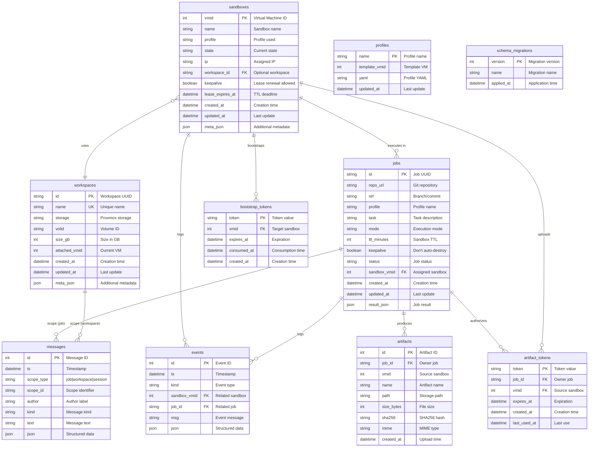

# AgentLab Architecture Diagrams

This document provides visual architecture diagrams for AgentLab using Mermaid syntax. All diagrams render natively on GitHub and can be previewed using tools like [mermaid.live](https://mermaid.live).

## Table of Contents

1. [System Architecture](#system-architecture)
2. [Sandbox State Machine](#sandbox-state-machine)
3. [Network Topology](#network-topology)
4. [Job Execution Data Flow](#job-execution-data-flow)
5. [Database Schema](#database-schema)
6. [Request Lifecycle](#request-lifecycle)
7. [Component Interaction](#component-interaction)

---

## System Architecture

The high-level system architecture shows all major components and their relationships.


### Component Descriptions

| Component | Description |
|-----------|-------------|
| **agentlab CLI** | Command-line interface for users to control sandboxes, jobs, and workspaces |
| **Unix Socket API** | Local-only API endpoint for secure daemon communication |
| **Sandbox Manager** | Manages VM lifecycle, state transitions, lease enforcement, and reconciliation |
| **Workspace Manager** | Handles persistent workspace volume creation, attachment, and detachment |
| **Job Orchestrator** | Coordinates job provisioning, bootstrap, execution, and artifact collection |
| **Proxmox Backend** | Abstraction layer supporting both API (HTTP) and Shell (CLI) backends |
| **SQLite Database** | Embedded database for sandboxes, jobs, workspaces, tokens, and events |
| **Bootstrap API** | Guest-facing API for VM initialization, secrets delivery, and job startup |
| **Artifact API** | Guest-facing API for uploading job results and artifacts |
| **agent-runner** | Service running inside template VMs for bootstrap and job execution |

---

## Sandbox State Machine

The sandbox state machine defines all valid states and transitions for VM sandboxes.


### State Descriptions

| State | Description | Allowed Operations |
|-------|-------------|-------------------|
| **REQUESTED** | Sandbox creation requested, VM not yet created | show, logs, destroy |
| **PROVISIONING** | VM being cloned and configured | show, logs, destroy |
| **BOOTING** | VM starting, waiting for guest agent | show, logs, destroy |
| **READY** | VM ready, waiting for job or manual use | show, logs, destroy |
| **RUNNING** | Job actively executing | show, logs, destroy, lease renew |
| **COMPLETED** | Job finished successfully | show, logs, destroy |
| **FAILED** | Job execution failed | show, logs, destroy |
| **TIMEOUT** | Lease expired, VM may be stopped | show, logs, destroy |
| **STOPPED** | VM stopped but not destroyed | show, logs, start, destroy |
| **DESTROYED** | VM destroyed, terminal state | show |

---

## Network Topology

The network architecture shows how AgentLab isolates sandbox VMs while providing controlled Internet access.


### Network Configuration

| Component | Configuration | Purpose |
|-----------|---------------|---------|
| **vmbr0** | LAN/WAN bridge (existing) | Host connectivity to Internet |
| **vmbr1** | Agent subnet (10.77.0.0/16) | Isolated sandbox network |
| **Host Address** | 10.77.0.1/16 | Gateway for sandbox VMs |
| **DHCP Pool** | 10.77.0.100 - 10.77.255.254 | IP assignment for sandboxes |
| **NAT/Masquerade** | vmbr1 → vmbr0 | Outbound Internet access |
| **Egress Rules** | Block RFC1918/ULA | Prevent private network access |
| **Bootstrap API** | 10.77.0.1:4242 | Guest initialization endpoint |
| **Artifact API** | 10.77.0.1:4243 | Artifact upload endpoint |
| **Tailscale** | Optional subnet router | Remote SSH access |

### Security Rules

```bash
# Allow outbound from agent subnet
iptables -A FORWARD -i vmbr1 -o vmbr0 -j ACCEPT
iptables -A FORWARD -i vmbr0 -o vmbr1 -m state --state RELATED,ESTABLISHED -j ACCEPT

# Masquerade outbound traffic
iptables -t nat -A POSTROUTING -s 10.77.0.0/16 -o vmbr0 -j MASQUERADE

# Block RFC1918 egress from agent subnet
iptables -A FORWARD -i vmbr1 -o vmbr0 -d 10.0.0.0/8 -j REJECT
iptables -A FORWARD -i vmbr1 -o vmbr0 -d 172.16.0.0/12 -j REJECT
iptables -A FORWARD -i vmbr1 -o vmbr0 -d 192.168.0.0/16 -j REJECT
iptables -A FORWARD -i vmbr1 -o vmbr0 -d fc00::/7 -j REJECT
```

---

## Job Execution Data Flow

The job execution flow shows how a job progresses from CLI command to artifact collection.


### Job Execution Stages

| Stage | Description | Duration |
|-------|-------------|----------|
| **Queued** | Job created, waiting for orchestration | < 1s |
| **Provisioning** | Clone VM, configure resources, start | 30-120s |
| **Booting** | VM boot, guest agent startup | 10-30s |
| **Bootstrap** | Agent initialization, secrets delivery | 5-10s |
| **Execution** | Task execution, variable by workload | User-defined |
| **Collection** | Artifact upload, cleanup | < 5s |
| **Finalization** | VM stop/destroy based on keepalive | < 10s |

---

## Database Schema

The database schema shows all tables and their relationships.



### Table Indexes

| Table | Indexes | Purpose |
|-------|---------|---------|
| **sandboxes** | `idx_sandboxes_state`, `idx_sandboxes_profile` | Filter by state/profile |
| **jobs** | `idx_jobs_status`, `idx_jobs_sandbox` | Filter by status/VM |
| **workspaces** | `idx_workspaces_attached` | Find attached workspaces |
| **events** | `idx_events_sandbox`, `idx_events_job` | Query by entity |
| **messages** | `idx_messages_scope`, `idx_messages_ts` | Query by scope/retention |
| **bootstrap_tokens** | `idx_bootstrap_tokens_vmid` | Token lookup by VM |
| **artifact_tokens** | `idx_artifact_tokens_job`, `idx_artifact_tokens_vmid` | Token validation |
| **artifacts** | `idx_artifacts_job`, `idx_artifacts_vmid` | Artifact lookup |

---

## Messagebox

Messagebox provides an append-only coordination log scoped to a job, workspace, or session.
Scopes are polymorphic: `scope_type` and `scope_id` identify the target entity without enforcing a foreign key.

Common usage patterns:
- **Job scope**: capture agent handoffs and decisions for a single job (`scope_type=job`, `scope_id=<job_id>`).
- **Workspace scope**: keep durable notes tied to a workspace (`scope_type=workspace`, `scope_id=<workspace_id>`).
- **Session scope**: share ad-hoc context across multiple agents (`scope_type=session`, `scope_id=<session_id>`).

Retention notes:
- Messages are stored in SQLite and are not auto-pruned today.
- Operators should implement retention externally (periodic cleanup/backup + vacuum) if needed.

## Request Lifecycle

The request lifecycle shows how a CLI command flows through the system to Proxmox.

```mermaid
graph TB
    Start([User Command]) --> Parse{Command Type?}

    Parse -->|Sandbox| SandboxCmd[Sandbox Command]
    Parse -->|Job| JobCmd[Job Command]
    Parse -->|Workspace| WorkspaceCmd[Workspace Command]

    SandboxCmd --> BuildReq[Build HTTP Request]
    JobCmd --> BuildReq
    WorkspaceCmd --> BuildReq

    BuildReq --> UnixSock[/run/agentlab/agentlabd.sock]

    UnixSock --> Auth{Authenticated?}
    Auth -->|No| Unauthorized([401 Unauthorized])
    Auth -->|Yes| Route[Route to Handler]

    Route --> Validate{Validate Input}
    Validate -->|Invalid| BadRequest([400 Bad Request])
    Validate -->|Valid| CheckManager{Manager Ready?}

    CheckManager -->|No| ServiceUnavailable([503 Service Unavailable])
    CheckManager -->|Yes| Execute[Execute Operation]

    Execute --> DBOp[(Database Operation)]
    DBOp --> ProxmoxOp{Proxmox Needed?}

    ProxmoxOp -->|Yes| Backend[Backend Call]
    Backend --> APIBackend{Backend Type?}
    APIBackend -->|API| HTTPCall[HTTP Request to<br/>Proxmox API]
    APIBackend -->|Shell| ShellCall[Shell Command<br/>qm/pvesh]

    HTTPCall --> ProxmoxResp[Proxmox Response]
    ShellCall --> ProxmoxResp

    ProxmoxOp -->|No| SkipProxmox[Skip Proxmox Call]

    ProxmoxResp --> RecordEvent[Record Event]
    SkipProxmox --> RecordEvent
    RecordEvent --> UpdateMetrics[Update Metrics]

    UpdateMetrics --> BuildResp[Build Response]
    BuildResp --> Serialize[Serialize JSON]

    Serialize --> Success([200 OK<br/>Response Body])

    Success --> Display[CLI Displays Result]
    Display --> End([Command Complete])

    Unauthorized --> End
    BadRequest --> End
    ServiceUnavailable --> End

    classDef startend fill:#e8f5e9,stroke:#2e7d32,stroke-width:2px
    classDef error fill:#ffebee,stroke:#c62828,stroke-width:2px
    classDef process fill:#e3f2fd,stroke:#1565c0,stroke-width:2px
    classDef storage fill:#fff3e0,stroke:#ef6c00,stroke-width:2px
    classDef decision fill:#fff9c4,stroke:#f9a825,stroke-width:2px

    class Start,End startend
    class Unauthorized,BadRequest,ServiceUnavailable error
    class SandboxCmd,JobCmd,WorkspaceCmd,BuildReq,Route,Execute,RecordEvent,UpdateMetrics,BuildResp,Serialize,Display process
    class DBOp storage
    class Parse,Auth,Validate,CheckManager,ProxmoxOp,APIBackend decision
```

### Error Handling

| Error Type | HTTP Status | Recovery |
|------------|-------------|----------|
| **Invalid Input** | 400 Bad Request | Fix command syntax |
| **Unauthorized** | 401 Unauthorized | Check socket permissions |
| **Not Found** | 404 Not Found | Verify resource exists |
| **Conflict** | 409 Conflict | Resolve state conflict |
| **Backend Error** | 502 Bad Gateway | Check Proxmox connectivity |
| **Service Unavailable** | 503 Service Unavailable | Restart daemon |
| **Internal Error** | 500 Internal Server Error | Check daemon logs |

---

## Component Interaction

Detailed component interaction showing internal daemon communication flows.


### Communication Patterns

| Pattern | Components | Description |
|---------|-----------|-------------|
| **API → Manager** | Direct method calls | Synchronous, in-process |
| **Manager → Backend** | Interface abstraction | Pluggable implementations |
| **Manager → Store** | Database transactions | ACID-compliant |
| **Manager → Metrics** | Prometheus counters | Non-blocking updates |
| **Backend → Proxmox** | HTTP/CLI | Network/Process execution |
| **Guest → Daemon** | HTTP callbacks | Token-authenticated |

---

## Key Design Principles

1. **Security First**
   - Unix socket for local-only control
   - Token-based guest authentication
   - Network isolation with controlled egress
   - Temporary secrets delivery (tmpfs only)

2. **State Management**
   - Single source of truth (SQLite)
   - State machine enforcement
   - Periodic reconciliation
   - Event logging for audit trail

3. **Backend Abstraction**
   - Pluggable Proxmox backends
   - API preferred (reliable)
   - Shell fallback (compatible)
   - Easy testing with mocks

4. **Observability**
   - Prometheus metrics
   - Structured events
   - Detailed logging
   - Health check endpoints

5. **Operational Safety**
   - Lease-based TTL enforcement
   - Automatic resource cleanup
   - Graceful shutdown
   - State recovery after restart

---

## Usage in Documentation

To include these diagrams in other documentation:

```markdown
<!-- Include system architecture -->
[AgentLab System Architecture](docs/architecture.md#system-architecture)

<!-- Embed specific diagram -->
```mermaid
paste-diagram-here
```
```

---

**Last Updated**: 2026-02-06
**Maintained By**: AgentLab Team
**License**: MIT
