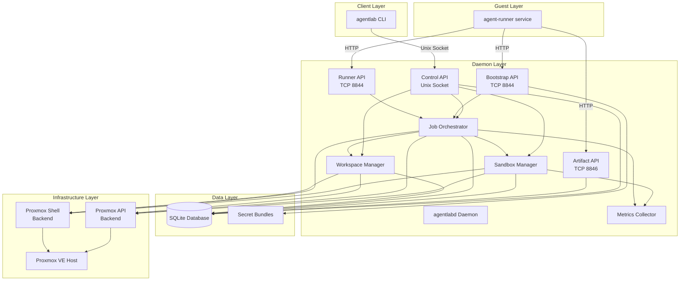
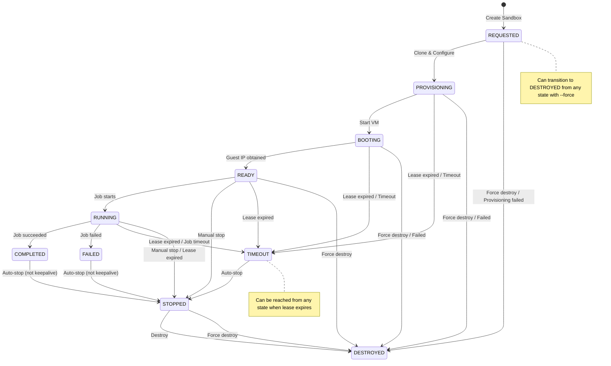

# AgentLab Technical Review Report

**Generated:** 2025-02-05
**Reviewer:** Codebase Audit
**Repository:** `/home/niko/agentlab`
**Version:** Based on git commit b9672c3

---

## 1. Executive Summary

**AgentLab** is a production-ready sandbox orchestration system for Proxmox VE (Virtual Environment). It enables automated VM provisioning, job execution, workspace management, and artifact collection for running AI coding agents in isolated environments. The system is built with Go and consists of two main components:

1. **`agentlabd`** - A daemon that runs on the Proxmox host, manages VM lifecycles, and exposes HTTP APIs (Unix socket for local control, TCP for guest bootstrap/runner communication)
2. **`agentlab`** - A CLI tool for users to control the daemon via Unix socket

### High-Level Architecture

The system uses a multi-tier architecture:
- **Daemon Layer** (`agentlabd`): Owns Proxmox access, enforces policy, manages state
- **CLI Layer** (`agentlab`): Thin client communicating over Unix socket
- **Proxmox Backend Layer**: Pluggable backend with two implementations - API backend (recommended, using Proxmox REST API) and Shell backend (fallback, using `qm`/`pvesh` commands)
- **Database Layer**: SQLite with WAL mode for state persistence
- **Guest Services**: `agent-runner` service inside VMs that bootstraps from daemon, executes jobs, and reports results

The system provisions unattended, network-isolated VM sandboxes with security defaults: RFC1918/ULA egress blocks, one-time secrets delivery via tmpfs, no host bind mounts, API token authentication, and optional persistent workspaces via separate disks.

---

## 2. Repository Inventory

```
agentlab/
├── cmd/
│   ├── agentlab/              # CLI application
│   │   ├── main.go           # Entry point, usage, dispatch
│   │   ├── commands.go       # All command handlers (job, sandbox, workspace, ssh, logs)
│   │   ├── ssh.go            # SSH command with tailnet route detection
│   │   ├── api.go            # HTTP client for daemon communication
│   │   └── testdata/         # Test fixtures
│   └── agentlabd/            # Daemon application
│       └── main.go           # Entry point (config load, service start)
│
├── internal/
│   ├── buildinfo/            # Version/build metadata injection
│   ├── config/               # Configuration management
│   │   └── config.go         # YAML config loading, validation, defaults
│   ├── daemon/               # Core daemon logic & HTTP APIs
│   │   ├── daemon.go         # Service wiring, listener setup, server lifecycle
│   │   ├── api.go            # Control API (Unix socket) - jobs, sandboxes, workspaces
│   │   ├── api_types.go      # Request/response type definitions
│   │   ├── sandbox_manager.go    # Sandbox state machine, transitions, GC, reconciliation
│   │   ├── workspace_manager.go  # Persistent volume management
│   │   ├── job_orchestrator.go   # Job provisioning, execution coordination
│   │   ├── profiles.go       # Profile YAML loading (multi-document support)
│   │   ├── profile_*.go      # Profile validation, behavior defaults, resources
│   │   ├── bootstrap_api.go  # Guest bootstrap endpoint (token-based secrets delivery)
│   │   ├── runner_api.go     # Guest runner report endpoint
│   │   ├── artifact_api.go   # Guest artifact upload endpoint
│   │   ├── artifact_gc.go    # Artifact cleanup job
│   │   ├── redaction.go      # Secret redaction for logs
│   │   └── metrics.go        # Prometheus metrics
│   ├── db/                   # SQLite database layer
│   │   ├── db.go             # Database connection, pragmas (WAL, FK)
│   │   ├── migrations.go     # Schema migrations (3 versions)
│   │   ├── sandboxes.go      # Sandbox CRUD, queries, state updates
│   │   ├── jobs.go           # Job CRUD, status updates, result storage
│   │   ├── workspaces.go     # Workspace CRUD, attachment tracking
│   │   ├── profiles.go       # Profile persistence
│   │   ├── events.go         # Event log for audit/debug
│   │   ├── bootstrap_tokens.go  # One-time bootstrap tokens
│   │   ├── artifact_tokens.go   # One-time artifact upload tokens
│   │   └── artifacts.go      # Artifact metadata storage
│   ├── models/               # Shared data models
│   │   └── models.go         # Sandbox, Job, Profile, Workspace types
│   ├── proxmox/              # Proxmox backend abstraction
│   │   ├── proxmox.go        # Backend interface definition
│   │   ├── api_backend.go    # HTTP API backend implementation (recommended)
│   │   ├── shell_backend.go  # Shell command backend implementation (fallback)
│   │   ├── cloudinit_snippets.go  # Cloud-init snippet management
│   │   └── errors.go         # Proxmox-specific errors
│   ├── secrets/              # Secret management
│   │   └── bundle.go         # Age/Sops secret bundle loading
│   ├── testing/              # Test utilities
│   │   ├── mocks.go          # Mock implementations
│   │   └── testutil.go       # Test helpers
│   └── buildinfo/            # Build-time version info
│
├── tests/
│   └── integration_test.go   # Integration tests
│
├── scripts/
│   ├── install_host.sh       # Host installation (binaries + systemd)
│   ├── create_template.sh    # Template VM creation
│   ├── systemd/
│   │   └── agentlabd.service # Systemd unit file
│   ├── net/
│   │   ├── setup_vmbr1.sh    # Agent bridge setup
│   │   ├── apply.sh          # NAT/egress rules
│   │   ├── setup_tailscale_router.sh  # Tailscale subnet routing
│   │   ├── agent_nat.nft     # nftables rules
│   │   └── smoke_test.sh     # Network validation
│   ├── profiles/
│   │   └── defaults.yaml     # Default profile configurations
│   ├── tests/                # Integration test scripts
│   └── guest/                # Guest VM files (agent-runner, services)
│
├── skills/
│   └── agentlab/             # Claude Code skill definition
│
├── docs/
│   ├── api.md                # API documentation
│   ├── runbook.md            # Operator runbook
│   ├── secrets.md            # Secret management guide
│   └── troubleshooting.md    # Troubleshooting guide
│
├── .github/workflows/
│   └── ci.yml                # GitHub Actions CI pipeline
│
├── bin/                      # Compiled binaries (gitignored)
├── dist/                     # Release builds (gitignored)
├── go.mod / go.sum           # Go module definition
├── Makefile                  # Build, test, lint targets
├── VERSION                   # Version string
├── LICENSE                   # MIT License
├── README.md                 # User-facing documentation
└── [Multiple .md docs]       # Development/specification documentation
```

### Key Files by Purpose

| Purpose | Key Files |
|---------|-----------|
| Entrypoints | `cmd/agentlab/main.go`, `cmd/agentlabd/main.go` |
| Configuration | `internal/config/config.go`, `/etc/agentlab/config.yaml` |
| Database Schema | `internal/db/migrations.go` |
| State Machine | `internal/daemon/sandbox_manager.go` |
| Job Orchestration | `internal/daemon/job_orchestrator.go` |
| Proxmox Integration | `internal/proxmox/api_backend.go`, `internal/proxmox/shell_backend.go` |
| CLI Commands | `cmd/agentlab/commands.go` |
| API Definition | `internal/daemon/api.go`, `internal/daemon/api_types.go` |
| Guest APIs | `internal/daemon/bootstrap_api.go`, `internal/daemon/runner_api.go`, `internal/daemon/artifact_api.go` |
| Profiles | `internal/daemon/profiles.go`, `internal/daemon/profile_*.go` |
| Secrets | `internal/secrets/bundle.go`, `/etc/agentlab/secrets/` |

---

## 3. How to Run

### Local Development

#### Prerequisites
- Go 1.24.0 or higher
- Proxmox VE 9.x+ host (for API backend) or 8.x+ (for shell backend)
- Access to Proxmox with `qm`/`pvesh` commands (shell backend) or API token (API backend)

#### Building

```bash
# Using Go directly
go build -o bin/agentlab ./cmd/agentlab
go build -o bin/agentlabd ./cmd/agentlabd

# Using Make
make build          # Builds all binaries
make lint          # Runs gofmt and go vet
make test          # Runs all tests
make test-coverage # Generates coverage report
make clean         # Removes build artifacts
```

#### Configuration

Configuration is loaded from `/etc/agentlab/config.yaml` (or specified path). Default values are in `internal/config/config.go:83-112`.

**Minimum config for API backend:**
```yaml
proxmox_backend: api
proxmox_api_url: https://127.0.0.1:8006
proxmox_api_token: root@pam!agentlab-api=<token-uuid>
```

**All configuration options (`internal/config/config.go:16-48`):**

| Field | Default | Description |
|-------|---------|-------------|
| `ConfigPath` | `/etc/agentlab/config.yaml` | Config file location |
| `ProfilesDir` | `/etc/agentlab/profiles` | Profile YAML files directory |
| `DataDir` | `/var/lib/agentlab` | Data directory |
| `LogDir` | `/var/log/agentlab` | Log directory |
| `RunDir` | `/run/agentlab` | Runtime directory (socket) |
| `SocketPath` | `/run/agentlab/agentlabd.sock` | Unix socket path |
| `DBPath` | `/var/lib/agentlab/agentlab.db` | SQLite database path |
| `BootstrapListen` | `10.77.0.1:8844` | Bootstrap API listen address |
| `ArtifactListen` | `10.77.0.1:8846` | Artifact upload listen address |
| `MetricsListen` | `""` (disabled) | Prometheus metrics endpoint |
| `AgentSubnet` | `""` (auto-derive) | Agent subnet CIDR |
| `ControllerURL` | `""` (auto-build) | Base URL for guest bootstrap |
| `ArtifactUploadURL` | `""` (auto-build) | Base URL for artifact uploads |
| `ArtifactDir` | `/var/lib/agentlab/artifacts` | Artifact storage directory |
| `ArtifactMaxBytes` | `268,435,456` (256MB) | Max artifact size |
| `ArtifactTokenTTLMinutes` | `1440` (24h) | Artifact token lifetime |
| `SecretsDir` | `/etc/agentlab/secrets` | Secret bundles directory |
| `SecretsBundle` | `default` | Default secrets bundle name |
| `SecretsAgeKeyPath` | `/etc/agentlab/keys/age.key` | Age decryption key |
| `SecretsSopsPath` | `sops` | Sops binary path |
| `SnippetsDir` | `/var/lib/vz/snippets` | Cloud-init snippet storage |
| `SnippetStorage` | `local` | Snippet storage backend |
| `SSHPublicKey` | `""` (from file) | SSH public key for injection |
| `SSHPublicKeyPath` | `""` | SSH public key file path |
| `ProxmoxCommandTimeout` | `2m` | Proxmox command timeout |
| `ProvisioningTimeout` | `10m` | Sandbox provisioning timeout |
| `ProxmoxBackend` | `api` | Backend type: `api` or `shell` |
| `ProxmoxAPIURL` | `https://localhost:8006` | Proxmox API URL |
| `ProxmoxAPIToken` | `""` (required for API) | API token string |
| `ProxmoxNode` | `""` (auto-detect) | Proxmox node name |

#### Running the Daemon

```bash
# Direct execution
sudo ./bin/agentlabd --config /etc/agentlab/config.yaml

# Via systemd (recommended)
sudo systemctl start agentlabd.service
sudo systemctl status agentlabd.service

# View logs
journalctl -u agentlabd.service -f
# or
tail -f /var/log/agentlab/agentlabd.log
```

#### Running the CLI

```bash
# The CLI connects to the daemon via Unix socket
./bin/agentlab --socket /run/agentlab/agentlabd.sock <command>

# List sandboxes
./bin/agentlab sandbox list

# Run a job
./bin/agentlab job run --repo https://github.com/user/repo \
  --task "run tests" --profile yolo-ephemeral

# SSH into a sandbox
./bin/agentlab ssh 1001
```

### Testing

```bash
# Run all tests
make test

# Run with coverage
make test-coverage

# Run race detector
make test-race

# Run integration tests (requires Proxmox)
go test -tags=integration ./tests/...
```

### Deployment

**Host Installation (from README.md):**

```bash
# 1. Build binaries
make build

# 2. Install binaries + systemd unit
sudo scripts/install_host.sh

# 3. Configure networking
sudo scripts/net/setup_vmbr1.sh --apply
sudo scripts/net/apply.sh --apply

# 4. (Recommended) Enable Tailscale subnet routing
sudo scripts/net/setup_tailscale_router.sh --apply

# 5. Create Proxmox API token and configure
pveum user token add root@pam agentlab-api --privsep=0
# Edit /etc/agentlab/config.yaml with api backend settings

# 6. Create secrets and minimal config/profile, then build template
sudo scripts/create_template.sh
sudo systemctl restart agentlabd.service

# 7. Run a test job
agentlab job run --repo <git-url> --task "<task>" --profile yolo-ephemeral
```

---

## 4. Architecture & Data Flow

### Component Overview

```
┌─────────────────────────────────────────────────────────────────────────────┐
│                              Proxmox VE Host                                │
│  ┌──────────────┐      ┌──────────────┐      ┌──────────────┐            │
│  │  agentlab    │      │  agentlabd   │      │   Proxmox    │            │
│  │     CLI      │◄────►│    Daemon    │◄────►│  Backend     │            │
│  │ (cmd/agentlab)│      │ (daemon/)    │      │(proxmox/)    │            │
│  └──────────────┘      └──────┬───────┘      └──────────────┘            │
│                                 │                                            │
│                         ┌───────┴──────────────────┐                      │
│                         │   SQLite Database       │                      │
│                         │   (/var/lib/agentlab/)   │                      │
│                         └──────────────────────────┘                      │
└─────────────────────────────────────────────────────────────────────────────┘
                                    │
                                    │ HTTP (agent subnet)
                                    ▼
┌─────────────────────────────────────────────────────────────────────────────┐
│                         Agent VM (Sandbox)                                  │
│  ┌──────────────┐      ┌──────────────┐      ┌──────────────┐            │
│  │agent-runner  │◄────►│  Bootstrap   │◄────►│   Job Task   │            │
│  │  (guest/)    │      │    Fetch     │      │  Execution   │            │
│  └──────────────┘      └──────────────┘      └──────────────┘            │
│         │                                                                       │
│         ▼                                                                       │
│  ┌──────────────┐      ┌──────────────┐                                     │
│  │   Report     │────►│ Artifact     │                                     │
│  │   Upload     │      │   Upload     │                                     │
│  └──────────────┘      └──────────────┘                                     │
└─────────────────────────────────────────────────────────────────────────────┘
```

### Module Responsibilities

| Module | Responsibility |
|--------|---------------|
| `cmd/agentlab` | CLI command parsing, API client, output formatting |
| `cmd/agentlabd` | Daemon entry point, config loading, service startup |
| `internal/config` | YAML config loading, validation, default values |
| `internal/daemon/daemon.go` | Service wiring, HTTP server setup, graceful shutdown |
| `internal/daemon/api.go` | Control API (Unix socket) - CRUD for jobs/sandboxes/workspaces |
| `internal/daemon/sandbox_manager.go` | Sandbox state machine, transitions, GC, reconciliation |
| `internal/daemon/job_orchestrator.go` | Job provisioning flow, VM cloning, bootstrapping |
| `internal/daemon/workspace_manager.go` | Persistent volume lifecycle, attach/detach |
| `internal/daemon/bootstrap_api.go` | Guest bootstrap endpoint (token auth, secrets delivery) |
| `internal/daemon/runner_api.go` | Guest runner report endpoint (status updates) |
| `internal/daemon/artifact_api.go` | Guest artifact upload (bearer token auth) |
| `internal/daemon/profiles.go` | Profile YAML loading (multi-document support) |
| `internal/daemon/metrics.go` | Prometheus metrics collection |
| `internal/db` | SQLite database operations, migrations, queries |
| `internal/models` | Shared data types (Sandbox, Job, Profile, Workspace) |
| `internal/proxmox/api_backend.go` | Proxmox REST API backend (recommended) |
| `internal/proxmox/shell_backend.go` | Shell command backend (fallback) |
| `internal/secrets` | Secret bundle loading (Age/Sops) |

### Request Lifecycle (Job Run)

```
User                       CLI                Daemon              Proxmox              Agent VM
 │                          │                  │                   │                    │
 ├─ job run ──────────────► │                  │                   │                    │
 │                          ├─ POST /v1/jobs ─► │                   │                    │
 │                          │                  ├─ Create Job(Queued)                    │
 │                          │                  ├─ Start goroutine ────────────────────►│
 │                          │                  │                   │                    │
 │                          │                  ├─ Allocate VMID    │                    │
 │                          │                  ├─ Clone VM ───────►│                    │
 │                          │                  │                   ├─ Create VM from     │
 │                          │                  │                   │  template          │
 │                          │                  │                   │                    │
 │                          │                  ├─ Create cloud-init snippet             │
 │                          │                  ├─ Configure VM ──►│                    │
 │                          │                  │                   ├─ Set CPU/memory/    │
 │                          │                  │                   │  network/cloud-init │
 │                          │                  │                   │                    │
 │                          │                  ├─ Start VM ──────►│                    │
 │                          │                  │                   ├─ Boot VM           │
 │                          │                  │                   │                    │
 │                          │                  ├─ Poll Guest IP ─►│                    │
 │                          │                  │                   ├─ Query qemu-guest-  │
 │                          │                  │                   │  agent IP           │
 │                          │                  │                   │                    │
 │                          │                  │                   │                    │
 │                          │                  │◄──────────────────┤                    │
 │                          │                  │   IP address      │                    │
 │                          │                  │                   │                    │
 │◄─ job created ───────────┤                  │                   │                    │
 │   (job_id)               │                  │                   │                    │
 │                          │                  │                   │                    │
 │                                                    ... VM boots ... │                    │
 │                                                          │        │                    │
 │                                                          │        │ ◄─ bootstrap fetch ┤
 │                                                          │        │    (with token)    │
 │                                                          ├────────┤                    │
 │                                                          │        │ └─ job config,     │
 │                                                          │        │   secrets          │
 │                                                          │        │                    │
 │                                                          │        │ └─ start task ────►│
 │                                                          │        │                    │
 │                                                          │        │ ◄─ runner report ─┤
 │                                                          ├────────┤   (status/         │
 │                                                          │        │    artifacts)      │
 │                                                          │        │                    │
 │                                                          │        │ ◄─ artifact upload ┤
 │                                                          ├────────┤                    │
 │                                                          │        │                    │
 │                          │                  │                   │                    │
 │◄─ job show ──────────────┤                  │                   │                    │
 │   (job status)            │                  │                   │                    │
```

### Key Runtime Flows

**1. Sandbox Provisioning Flow** (`internal/daemon/job_orchestrator.go:108-243`):
```
Create Sandbox → REQUESTED
   ↓
Validate Template & Profile
   ↓
Clone VM from Template (Proxmox backend)
   ↓
Generate Bootstrap Token → Store in DB
   ↓
Create Cloud-Init Snippet → Upload to Proxmox
   ↓
Configure VM (CPU, memory, network, cloud-init)
   ↓
Attach Workspace (if specified)
   ↓
Start VM
   ↓
Poll for Guest IP (qemu-guest-agent → DHCP fallback)
   ↓
Update State: PROVISIONING → BOOTING → READY → RUNNING
```

**2. Job Execution Flow** (`internal/daemon/job_orchestrator.go:93-106`):
```
Create Job (QUEUED) → Start Goroutine
   ↓
Ensure Sandbox (create or attach existing)
   ↓
Provision Sandbox (if new)
   ↓
Guest Boots → agent-runner starts
   ↓
Guest: Fetch Bootstrap (validate token, get job config + secrets)
   ↓
Guest: Execute Task
   ↓
Guest: Upload Artifacts (bearer token auth)
   ↓
Guest: Report Status (COMPLETED/FAILED/TIMEOUT)
   ↓
Daemon: Update Job Status → Transition Sandbox State
   ↓
If not keepalive: Destroy Sandbox
```

**3. Bootstrap Token Flow** (`internal/daemon/bootstrap_api.go:75-190`):
```
Job Created → Generate Token (16 random bytes) → Hash (SHA-256)
   ↓
Store {token_hash, vmid, expires_at} in database
   ↓
Token included in cloud-init snippet
   ↓
Guest: POST /v1/bootstrap/fetch with {token, vmid}
   ↓
Daemon: Validate token (hash matches, not expired, not consumed)
   ↓
Daemon: Load secrets bundle, generate artifact token
   ↓
Daemon: Consume bootstrap token (one-time use)
   ↓
Return: {job, git secrets, env, artifact_endpoint, policy}
```

**4. State Reconciliation Flow** (`internal/daemon/sandbox_manager.go:383-423`):
```
Every 30 seconds (defaultLeaseGCInterval):
   ↓
1. Lease GC: Find expired sandboxes → Stop → Destroy
   ↓
2. State Reconciliation:
   - For each sandbox in DB:
     - Query Proxmox for actual VM status
     - If VM not found → mark DESTROYED
     - If VM stopped but state=RUNNING → mark FAILED
     - If VM running but state=REQUESTED → mark READY
```

### Cross-Cutting Concerns

**Authentication:**
- Local CLI: Unix socket permissions (0o660)
- Guest bootstrap: One-time tokens (SHA-256 hashed, single-use)
- Artifact upload: Bearer tokens (SHA-256 hashed, TTL)
- Proxmox API: Token-based (PVEAPIToken header)

**Authorization:**
- Bootstrap/Runner/Artifact APIs: IP-based (agent subnet only)
- Control API: Unix socket (local access)

**Logging:**
- Daemon: `/var/log/agentlab/agentlabd.log`
- Systemd: `journalctl -u agentlabd.service`
- Structured logging with `log.Printf()`
- Event log in database for audit trail

**Metrics** (`internal/daemon/metrics.go`):
- Prometheus format at `/metrics` (if `metrics_listen` configured)
- Sandbox counts by state, lifecycle counters, provision duration
- Job counts by status, duration histograms
- Workspace counts, attachment counts

**Error Handling:**
- Custom errors: `ErrInvalidTransition`, `ErrSandboxNotFound`, `ErrWorkspaceNotFound`, etc.
- Error wrapping with `fmt.Errorf`: preserve context
- HTTP errors: JSON response with `{"error":"message", "details":"..."}`

**Validation:**
- Config validation: `internal/config/config.go:254-345`
- Profile validation: `internal/daemon/profile_validation.go`
- State machine enforcement: `allowedTransition()` in sandbox_manager.go
- Request validation: JSON decode with size limits (1MB), path sanitization

**Rate Limiting:**
- None implemented (single-admin deployment model)

**Caching:**
- Profile loading: Daemon startup, in-memory map
- No response caching (state queries go to DB)

### Data Layer

**Database:** SQLite3 (`modernc.org/sqlite` - pure Go implementation)

**Connection Settings** (`internal/db/db.go:70-82`):
```go
PRAGMA foreign_keys = ON;
PRAGMA journal_mode = WAL;         // Write-Ahead Logging
PRAGMA busy_timeout = 5000;        // 5 second lock timeout
```

**Schema Overview** (`internal/db/migrations.go`):

| Table | Purpose | Key Fields |
|-------|---------|------------|
| `sandboxes` | VM sandbox state | vmid (PK), name, profile, state, ip, workspace_id, keepalive, lease_expires_at |
| `jobs` | Job execution records | id (PK), repo_url, ref, profile, task, mode, ttl_minutes, keepalive, status, sandbox_vmid, result_json |
| `profiles` | Profile configurations | name (PK), template_vmid, yaml, updated_at |
| `workspaces` | Persistent volumes | id (PK), name (unique), storage, volid, size_gb, attached_vmid |
| `bootstrap_tokens` | One-time bootstrap tokens | token (PK, SHA-256 hash), vmid, expires_at, consumed_at |
| `artifact_tokens` | One-time upload tokens | token (PK, SHA-256 hash), job_id, vmid, expires_at, last_used_at |
| `artifacts` | Artifact metadata | id (PK auto), job_id, vmid, name, path, size_bytes, sha256, mime, created_at |
| `events` | Event log | id (PK auto), ts, kind, sandbox_vmid, job_id, msg, json |
| `schema_migrations` | Migration tracking | version (PK), name, applied_at |

**Indexes:**
- `idx_sandboxes_state`, `idx_sandboxes_profile`
- `idx_jobs_status`, `idx_jobs_sandbox`
- `idx_workspaces_attached`
- `idx_bootstrap_tokens_vmid`
- `idx_artifact_tokens_job`, `idx_artifact_tokens_vmid`
- `idx_artifacts_job`, `idx_artifacts_vmid`
- `idx_events_sandbox`, `idx_events_job`

**Transactions:**
- Used in migrations for atomic schema changes
- Not explicitly used in CRUD operations (single-connection SQLite)

### Integration Points

**Proxmox VE** (`internal/proxmox/`):
- API Backend: HTTPS + API token authentication
- Shell Backend: `qm`, `pvesh` commands
- Operations: Clone, Configure, Start, Stop, Destroy, Status, GuestIP, CreateVolume, AttachVolume, DetachVolume, DeleteVolume, ValidateTemplate

**Secret Bundles** (`internal/secrets/bundle.go`):
- Age encryption (filippo.io/age)
- Sops integration (external binary)
- Location: `/etc/agentlab/secrets/<bundle>.yaml` or `.age`

**Guest Services**:
- `agent-runner`: Guest service that fetches bootstrap config, executes tasks, uploads artifacts
- `agentlab-workspace-setup`: Workspace mount setup
- Communication: HTTP over agent subnet (10.77.0.0/16 default)

---

## 5. Feature-by-Feature Walkthrough

### Sandbox Management

**What it does:** Creates, monitors, and destroys VM sandboxes on Proxmox with state tracking and lease management.

**Primary code paths:**
- CLI: `cmd/agentlab/commands.go:417-443` (dispatch), `471-537` (new), `539-564` (list), `566-599` (show), `601-637` (destroy)
- API: `internal/daemon/api.go:405-414` (list), `536-547` (show), `549-714` (create), `887-928` (destroy)
- State Machine: `internal/daemon/sandbox_manager.go:119-153` (transition), `182-211` (destroy), `356-381` (allowed transitions)

**Dependencies:**
- DB: `sandboxes` table for state, `workspaces` for attachment
- Proxmox Backend: VM lifecycle operations
- Job Orchestrator: For provisioning job-associated sandboxes

**Sandbox States** (`internal/models/models.go:5-18`):
```
REQUESTED → PROVISIONING → BOOTING → READY → RUNNING → COMPLETED/FAILED/TIMEOUT → STOPPED → DESTROYED
     │              │            │       │          │            │         │
     └──────────────┴────────────┴───────┴──────────┴────────────┴─────────┘
                              Any state can transition to DESTROYED (with --force)
                              TIMEOUT can be reached from any state when lease expires
```

**Edge cases & handling:**
- **VM not found in Proxmox:** Reconciler marks as DESTROYED
- **Stuck in REQUESTED:** Reconciler detects running VM → marks READY
- **Lease expiration:** Background GC stops/destroys VM
- **Invalid state transition:** Returns `ErrInvalidTransition` with current→target
- **Force destroy:** Bypasses state checks, directly destroys VM

**Tests:** `internal/daemon/sandbox_manager_test.go`, `internal/daemon/daemon_lifecycle_test.go`

### Job Execution

**What it does:** Orchestrates end-to-end job execution including sandbox provisioning, guest bootstrap, task execution, and artifact collection.

**Primary code paths:**
- CLI: `cmd/agentlab/commands.go:138-158` (dispatch), `160-216` (run), `218-261` (show)
- API: `internal/daemon/api.go:75-227` (create), `229-270` (show)
- Orchestration: `internal/daemon/job_orchestrator.go:93-244` (Run), `246-417` (ProvisionSandbox), `419-491` (HandleReport)

**Dependencies:**
- DB: `jobs`, `sandboxes`, `bootstrap_tokens`, `artifact_tokens`, `artifacts` tables
- Proxmox Backend: VM operations
- Profile System: Template selection, behavior defaults
- Secret Bundles: Git credentials, API keys, environment variables
- Workspace Manager: Optional workspace attachment

**Job Status Flow:**
```
QUEUED → RUNNING → COMPLETED/FAILED/TIMEOUT
```

**Edge cases & handling:**
- **Template validation fails:** Job marked FAILED, no VM created
- **Provisioning timeout:** Context cancellation, VM cleanup, job marked FAILED
- **Guest agent not responding:** IP polling with exponential backoff (30 attempts), fallback to DHCP lease parsing
- **Job already finalized:** Returns `ErrJobFinalized` on duplicate reports
- **Sandbox mismatch:** Returns `ErrJobSandboxMismatch` if VMID doesn't match job

**Tests:** `internal/daemon/daemon_lifecycle_test.go`, `cmd/agentlab/commands_happy_path_test.go`

### Workspace Management

**What it does:** Manages persistent storage volumes that can be attached to multiple sandboxes over time (for preserving state between jobs).

**Primary code paths:**
- CLI: `cmd/agentlab/commands.go:445-469` (dispatch), `730-777` (create), `779-803` (list), `805-842` (attach), `844-876` (detach), `878-931` (rebind)
- API: `internal/daemon/api.go:716-747` (create), `749-764` (list), `766-781` (get), `783-812` (attach), `814-832` (detach), `834-885` (rebind)
- Manager: `internal/daemon/workspace_manager.go:55-110` (create), `144-197` (attach), `199-230` (detach)

**Dependencies:**
- DB: `workspaces` table, `sandboxes.workspace_id` foreign key
- Proxmox Backend: Volume creation, attachment, detachment
- Slot: Uses `scsi1` for workspace disk

**Workspace Lifecycle:**
```
Create Volume → Register in DB (detached)
   ↓
Attach to VM → Update VM config (scsi1=volume) → Mark attached in DB
   ↓
Detach from VM → Remove scsi1 from VM config → Mark detached in DB
   ↓
Can be re-attached to new VM (rebind operation)
```

**Edge cases & handling:**
- **Name collision:** Returns `ErrWorkspaceExists` on duplicate names
- **Already attached:** Returns `ErrWorkspaceAttached` with current VMID
- **VM has workspace:** Returns `ErrWorkspaceVMInUse` if attaching another
- **VM not found:** Returns `ErrSandboxNotFound` on attach to non-existent VM
- **Rebind with running VM:** Creates new VM, detaches old, attaches workspace, optionally destroys old VM

**Tests:** `internal/daemon/daemon_lifecycle_test.go`

### Profile System

**What it does:** Defines reusable sandbox configurations including template VM, resource allocation, behavior defaults, and inner sandbox settings.

**Primary code paths:**
- Loading: `internal/daemon/profiles.go:24-79`
- Validation: `internal/daemon/profile_validation.go`
- Behavior Defaults: `internal/daemon/profile_behavior.go`
- Resources: `internal/daemon/profile_resources.go`
- Inner Sandbox: `internal/daemon/profile_inner_sandbox.go`

**Profile YAML structure** (`scripts/profiles/defaults.yaml`):
```yaml
name: profile-name
template_vmid: 9000
behavior:
  ttl_minutes: 30
  keepalive: false
resources:
  cores: 4
  memory_mb: 8192
  cpu_pinning: "2-5"
inner_sandbox:
  name: firecracker
  args: ["--kernel", "/path/to/kernel"]
```

**Dependencies:**
- File System: `/etc/agentlab/profiles/*.yaml`
- Database: `profiles` table for template VM reference
- Proxmox Backend: Template validation

**Edge cases & handling:**
- **Duplicate profile names:** Returns error during loading
- **Invalid template VMID:** Returns validation error
- **Missing template in Proxmox:** Validation fails before provisioning
- **Multi-document YAML:** Supported, documents separated by `---`

### Guest Bootstrap

**What it does:** Delivers job configuration, secrets, and policy to guest VMs via one-time token authentication.

**Primary code paths:**
- API: `internal/daemon/bootstrap_api.go:68-190` (handleBootstrapFetch)
- Token validation: `internal/db/bootstrap_tokens.go:33-66`

**Dependencies:**
- DB: `bootstrap_tokens` table
- Secrets Store: Bundle loading (Age/Sops)
- Token System: SHA-256 hashed tokens, single-use

**Bootstrap Response:**
```json
{
  "job": {
    "id": "job_abc123",
    "repo_url": "https://github.com/user/repo",
    "ref": "main",
    "task": "run tests",
    "mode": "dangerous",
    "profile": "yolo-ephemeral",
    "keepalive": false,
    "ttl_minutes": 30
  },
  "git": {
    "token": "ghp_xxx",
    "ssh_private_key": "...",
    "ssh_public_key": "...",
    "known_hosts": "..."
  },
  "env": {
    "API_KEY": "xxx"
  },
  "claude_settings_json": "{...}",
  "artifact": {
    "endpoint": "http://10.77.0.1:8846/upload",
    "token": "artifact-token-hex"
  },
  "policy": {
    "mode": "dangerous",
    "inner_sandbox": "firecracker",
    "inner_sandbox_args": ["--kernel", "/path"]
  }
}
```

**Edge cases & handling:**
- **Invalid token:** Returns 403 Forbidden
- **Expired token:** Returns 403 Forbidden
- **Already consumed:** Returns 403 Forbidden
- **Missing job:** Returns 404 Not Found
- **Secrets bundle missing:** Returns 500 Internal Server Error

### Artifact Collection

**What it does:** Receives artifact uploads from guest VMs via bearer token authentication, stores files on disk, tracks metadata in database.

**Primary code paths:**
- Upload API: `internal/daemon/artifact_api.go:52-227` (handleUpload)
- CLI download: `cmd/agentlab/commands.go:311-415` (download)
- GC: `internal/daemon/artifact_gc.go`

**Dependencies:**
- DB: `artifact_tokens`, `artifacts` tables
- File System: `/var/lib/agentlab/artifacts/<job_id>/`
- Token System: Bearer token validation, TTL tracking

**Upload Request:**
```
POST /upload
Authorization: Bearer <artifact-token>
Content-Type: <mime-type>
?path=<relative-path>

<binary body>
```

**Edge cases & handling:**
- **Invalid token:** Returns 403 Forbidden
- **Expired token:** Returns 403 Forbidden
- **Oversized upload:** `http.MaxBytesReader` returns 413 Request Entity Too Large
- **Path traversal:** `sanitizeArtifactPath()` and `safeJoin()` prevent directory escapes
- **Empty body:** Returns 400 Bad Request
- **Concurrent uploads:** Token last_used_at timestamp updated on each upload

**Tests:** `internal/daemon/artifact_api_test.go`

### SSH Access

**What it does:** Generates SSH command for connecting to sandbox VMs, with Tailscale route detection and warning.

**Primary code paths:**
- CLI: `cmd/agentlab/ssh.go:44-142` (runSSHCommand)
- Route detection: `165-197` (tailnetWarning)

**Dependencies:**
- API: Sandbox lookup for IP address
- System: `ssh` binary (via exec or command output)

**SSH Command Generation:**
```bash
ssh -i <identity> -p <port> <user>@<ip>
```

**Edge cases & handling:**
- **No IP assigned:** Returns error "has no IP yet"
- **Invalid IP:** Returns error "returned invalid IP"
- **Missing ssh binary:** Returns error from `exec.LookPath`
- **Route not via Tailscale:** Prints warning (non-blocking)
- **Non-interactive terminal:** `--exec` flag requires TTY

---

## 6. API Documentation

### Control API (Unix Socket)

**Base:** Unix socket at `/run/agentlab/agentlabd.sock`
**Authentication:** Unix socket permissions (0o660)
**Content-Type:** `application/json`

#### Jobs

##### Create Job
```
POST /v1/jobs
Content-Type: application/json

{
  "repo_url": "https://github.com/user/repo",
  "ref": "main",
  "profile": "yolo-ephemeral",
  "task": "run tests",
  "mode": "dangerous",
  "ttl_minutes": 30,
  "keepalive": false
}

Response 201 Created:
{
  "id": "job_abc123",
  "repo_url": "https://github.com/user/repo",
  "ref": "main",
  "profile": "yolo-ephemeral",
  "task": "run tests",
  "mode": "dangerous",
  "ttl_minutes": 30,
  "keepalive": false,
  "status": "QUEUED",
  "created_at": "2025-02-05T12:00:00Z",
  "updated_at": "2025-02-05T12:00:00Z"
}
```
**Source:** `internal/daemon/api.go:124-227`

##### Get Job
```
GET /v1/jobs/{job_id}?events_tail=50

Response 200 OK:
{
  "id": "job_abc123",
  "status": "COMPLETED",
  "sandbox_vmid": 1001,
  "result": {
    "status": "COMPLETED",
    "message": "All tests passed",
    "artifacts": [...],
    "reported_at": "2025-02-05T12:30:00Z"
  },
  "events": [
    {
      "id": 1,
      "ts": "2025-02-05T12:00:00Z",
      "kind": "job.running",
      "sandbox_vmid": 1001,
      "job_id": "job_abc123",
      "msg": "sandbox running",
      "json": null
    }
  ],
  ...
}
```
**Source:** `internal/daemon/api.go:229-270`

##### List Job Artifacts
```
GET /v1/jobs/{job_id}/artifacts

Response 200 OK:
{
  "job_id": "job_abc123",
  "artifacts": [
    {
      "name": "test-results.xml",
      "path": "test-results.xml",
      "size_bytes": 12345,
      "sha256": "abc123...",
      "mime": "application/xml",
      "created_at": "2025-02-05T12:30:00Z"
    }
  ]
}
```
**Source:** `internal/daemon/api.go:272-299`

##### Download Artifact
```
GET /v1/jobs/{job_id}/artifacts/download?path=<path>&name=<name>

Response 200 OK:
Content-Type: <mime-type>
Content-Disposition: attachment; filename="<name>"
Content-Length: <size>

<binary content>
```
**Source:** `internal/daemon/api.go:301-403`

#### Sandboxes

##### List Sandboxes
```
GET /v1/sandboxes

Response 200 OK:
{
  "sandboxes": [
    {
      "vmid": 1001,
      "name": "sandbox-1001",
      "profile": "yolo-ephemeral",
      "state": "RUNNING",
      "ip": "10.77.0.130",
      "workspace_id": "workspace-abc123",
      "keepalive": false,
      "lease_expires_at": "2025-02-05T13:00:00Z",
      "created_at": "2025-02-05T12:00:00Z",
      "updated_at": "2025-02-05T12:05:00Z"
    }
  ]
}
```
**Source:** `internal/daemon/api.go:523-534`

##### Get Sandbox
```
GET /v1/sandboxes/{vmid}

Response 200 OK:
{
  "vmid": 1001,
  "name": "sandbox-1001",
  "profile": "yolo-ephemeral",
  "state": "RUNNING",
  ...
}
```
**Source:** `internal/daemon/api.go:536-547`

##### Create Sandbox
```
POST /v1/sandboxes
Content-Type: application/json

{
  "name": "my-sandbox",
  "profile": "yolo-ephemeral",
  "ttl_minutes": 30,
  "keepalive": false,
  "workspace_id": "workspace-abc123",
  "vmid": 1001,
  "job_id": "job_abc123"
}

Response 201 Created:
{
  "vmid": 1001,
  "name": "my-sandbox",
  "state": "REQUESTED",
  ...
}
```
**Source:** `internal/daemon/api.go:549-714`

##### Destroy Sandbox
```
POST /v1/sandboxes/{vmid}/destroy
Content-Type: application/json

{
  "force": false
}

Response 200 OK:
{
  "vmid": 1001,
  "state": "DESTROYED",
  ...
}
```
**Source:** `internal/daemon/api.go:887-928`

##### Renew Lease
```
POST /v1/sandboxes/{vmid}/lease/renew
Content-Type: application/json

{
  "ttl_minutes": 60
}

Response 200 OK:
{
  "vmid": 1001,
  "lease_expires_at": "2025-02-05T14:00:00Z"
}
```
**Source:** `internal/daemon/api.go:930-968`

##### Prune Sandboxes
```
POST /v1/sandboxes/prune

Response 200 OK:
{
  "count": 3
}
```
**Source:** `internal/daemon/api.go:970-985`

##### Get Sandbox Events
```
GET /v1/sandboxes/{vmid}/events?after=<id>&tail=<n>&limit=<n>

Response 200 OK:
{
  "events": [
    {
      "id": 1,
      "ts": "2025-02-05T12:00:00Z",
      "kind": "sandbox.state",
      "sandbox_vmid": 1001,
      "job_id": null,
      "msg": "REQUESTED -> PROVISIONING",
      "json": null
    }
  ],
  "last_id": 42
}
```
**Source:** `internal/daemon/api.go:987-1043`

#### Workspaces

##### Create Workspace
```
POST /v1/workspaces
Content-Type: application/json

{
  "name": "my-workspace",
  "size_gb": 100,
  "storage": "local-zfs"
}

Response 201 Created:
{
  "id": "workspace-abc123",
  "name": "my-workspace",
  "storage": "local-zfs",
  "volid": "local-zfs:vm-1001-disk-1",
  "size_gb": 100,
  "attached_vmid": null,
  "created_at": "2025-02-05T12:00:00Z",
  "updated_at": "2025-02-05T12:00:00Z"
}
```
**Source:** `internal/daemon/api.go:716-747`

##### List Workspaces
```
GET /v1/workspaces

Response 200 OK:
{
  "workspaces": [...]
}
```
**Source:** `internal/daemon/api.go:749-764`

##### Get Workspace
```
GET /v1/workspaces/{id_or_name}

Response 200 OK:
{...}
```
**Source:** `internal/daemon/api.go:766-781`

##### Attach Workspace
```
POST /v1/workspaces/{id_or_name}/attach
Content-Type: application/json

{
  "vmid": 1001
}

Response 200 OK:
{
  "id": "workspace-abc123",
  "attached_vmid": 1001,
  ...
}
```
**Source:** `internal/daemon/api.go:783-812`

##### Detach Workspace
```
POST /v1/workspaces/{id_or_name}/detach

Response 200 OK:
{
  "id": "workspace-abc123",
  "attached_vmid": null,
  ...
}
```
**Source:** `internal/daemon/api.go:814-832`

##### Rebind Workspace
```
POST /v1/workspaces/{id_or_name}/rebind
Content-Type: application/json

{
  "profile": "yolo-ephemeral",
  "ttl_minutes": 30,
  "keep_old": false
}

Response 200 OK:
{
  "workspace": {...},
  "sandbox": {...},
  "old_vmid": 1001
}
```
**Source:** `internal/daemon/api.go:834-885`

### Guest APIs (Agent Subnet)

**Base:** `http://10.77.0.1:8844` (bootstrap), `:8846` (artifacts)
**Authentication:** Token-based (bootstrap tokens, artifact bearer tokens)
**IP Restriction:** Only agent subnet (10.77.0.0/16 default)

#### Bootstrap API

##### Fetch Bootstrap Config
```
POST /v1/bootstrap/fetch
Content-Type: application/json

{
  "token": "bootstrap-token-plaintext",
  "vmid": 1001
}

Response 200 OK:
{
  "job": {...},
  "git": {
    "token": "github-token",
    "username": "user",
    "ssh_private_key": "...",
    "ssh_public_key": "...",
    "known_hosts": "..."
  },
  "env": {"API_KEY": "xxx"},
  "claude_settings_json": "{...}",
  "artifact": {
    "endpoint": "http://10.77.0.1:8846/upload",
    "token": "artifact-token-plaintext"
  },
  "policy": {
    "mode": "dangerous",
    "inner_sandbox": "firecracker",
    "inner_sandbox_args": ["--kernel", "/path"]
  }
}
```
**Source:** `internal/daemon/bootstrap_api.go:75-190`

#### Runner API

##### Report Job Status
```
POST /v1/runner/report
Content-Type: application/json

{
  "job_id": "job_abc123",
  "vmid": 1001,
  "status": "COMPLETED",
  "message": "All tests passed",
  "artifacts": [
    {
      "name": "test-results.xml",
      "path": "test-results.xml",
      "size_bytes": 12345,
      "sha256": "abc123...",
      "mime": "application/xml"
    }
  ],
  "result": {"custom": "data"}
}

Response 200 OK:
{
  "job_status": "COMPLETED",
  "sandbox_status": "COMPLETED"
}
```
**Source:** `internal/daemon/runner_api.go:29-90`

#### Artifact API

##### Upload Artifact
```
POST /upload
Authorization: Bearer <artifact-token>
Content-Type: <mime-type>
?path=<relative-path>

<binary body>

Response 201 Created:
{
  "job_id": "job_abc123",
  "artifact": {
    "name": "test-results.xml",
    "path": "test-results.xml",
    "size_bytes": 12345,
    "sha256": "abc123...",
    "mime": "application/xml"
  }
}
```
**Source:** `internal/daemon/artifact_api.go:52-227`

### Global Middleware

- **Content-Type:** `application/json` for all request bodies
- **Request Size Limit:** 1MB max (enforced via `http.MaxBytesReader`)
- **Response Format:** JSON with `error` field on failures, `details` for context
- **CORS:** Not implemented (Unix socket + private subnet only)

### Versioning Strategy

No API versioning in URLs. API is `v1` by design:
- Control API: `/v1/jobs`, `/v1/sandboxes`, `/v1/workspaces`
- Guest APIs: `/v1/bootstrap/fetch`, `/v1/runner/report`

### Pagination

Not implemented. List endpoints return all records (expected small scale).

### Filtering

- Jobs: Filter by ID only
- Sandboxes: Filter by VMID only
- Events: `?after=<id>`, `?tail=<n>`, `?limit=<n>`

### Idempotency

- Create sandbox: VMID allocation may fail on collision (retries up to 5 times)
- Create job: Job ID generation may fail on collision (retries up to 5 times)
- Destroy sandbox: Idempotent (no-op if already destroyed)
- Attach workspace: Idempotent if already attached to same VM
- Consume token: Not idempotent (one-time use only)

---

## 7. CLI Documentation

### Global Options

```
agentlab [global flags] <command> [command flags]

Global Flags:
  --socket PATH   Path to agentlabd socket (default: /run/agentlab/agentlabd.sock)
  --json          Output JSON format
  --timeout DURATION   Request timeout (default: 10m, e.g., 30s, 2m)
  --version       Print version and exit
  --help, -h      Show help
```

**Source:** `cmd/agentlab/main.go:118-142`, `cmd/agentlab/commands.go:74-78`

### Job Commands

#### job run
```
agentlab job run --repo <url> --task <task> --profile <profile> [flags]

Required Flags:
  --repo <url>      Git repository URL
  --task <task>     Task description or command
  --profile <name>  Profile name

Optional Flags:
  --ref <ref>       Git branch/commit (default: main)
  --mode <mode>     Execution mode (default: dangerous)
  --ttl <duration>  Sandbox TTL (e.g., 120, 2h, 30m)
  --keepalive       Keep sandbox after completion

Example:
  agentlab job run --repo https://github.com/user/repo \
    --task "npm test" --profile yolo-ephemeral --ttl 1h
```

**Source:** `cmd/agentlab/commands.go:160-216`

#### job show
```
agentlab job show <job_id> [flags]

Flags:
  --events-tail <n>   Number of recent events (0 to omit, default: 50)

Example:
  agentlab job show job_abc123 --events-tail 10
```

**Source:** `cmd/agentlab/commands.go:218-261`

#### job artifacts
```
agentlab job artifacts <job_id>

Lists all artifacts for a job.
```

**Source:** `cmd/agentlab/commands.go:276-309`

#### job artifacts download
```
agentlab job artifacts download <job_id> [flags]

Flags:
  --out <path>      Output file or directory (default: current dir)
  --path <path>     Download by artifact path
  --name <name>     Download by artifact name
  --latest          Download latest artifact
  --bundle          Download bundle (default: agentlab-artifacts.tar.gz)

Examples:
  # Download latest bundle
  agentlab job artifacts download job_abc123 --bundle

  # Download specific file
  agentlab job artifacts download job_abc123 --name test-results.xml

  # Download to directory
  agentlab job artifacts download job_abc123 --out ./artifacts
```

**Source:** `cmd/agentlab/commands.go:311-415`

### Sandbox Commands

#### sandbox new
```
agentlab sandbox new --profile <profile> [flags]

Required Flags:
  --profile <name>  Profile name

Optional Flags:
  --name <name>     Sandbox name
  --ttl <duration>  Lease TTL (e.g., 120, 2h, 30m)
  --keepalive       Enable lease renewal
  --workspace <id>  Attach workspace by ID/name
  --vmid <id>       Force specific VMID
  --job <id>        Attach to existing job

Examples:
  # Basic sandbox
  agentlab sandbox new --profile yolo-ephemeral --name test-sandbox --ttl 1h

  # With workspace
  agentlab sandbox new --profile yolo-ephemeral --workspace my-workspace
```

**Source:** `cmd/agentlab/commands.go:471-537`

#### sandbox list
```
agentlab sandbox list

Lists all sandboxes with state, IP, and lease info.
```

**Source:** `cmd/agentlab/commands.go:539-564`

#### sandbox show
```
agentlab sandbox show <vmid>

Shows detailed sandbox information.
```

**Source:** `cmd/agentlab/commands.go:566-599`

#### sandbox destroy
```
agentlab sandbox destroy [--force] <vmid>

Flags:
  --force    Destroy in any state (bypasses state checks)

Examples:
  agentlab sandbox destroy 1001
  agentlab sandbox destroy --force 1001
```

**Source:** `cmd/agentlab/commands.go:601-637`

#### sandbox lease renew
```
agentlab sandbox lease renew --ttl <duration> <vmid>

Flags:
  --ttl <duration>   New lease duration (required)

Note: Flags must come before vmid (e.g., --ttl 120 1009)

Example:
  agentlab sandbox lease renew --ttl 2h 1001
```

**Source:** `cmd/agentlab/commands.go:657-701`

#### sandbox prune
```
agentlab sandbox prune

Removes orphaned sandboxes (TIMEOUT state, VM not in Proxmox).
```

**Source:** `cmd/agentlab/commands.go:703-728`

### Workspace Commands

#### workspace create
```
agentlab workspace create --name <name> --size <size> [flags]

Required Flags:
  --name <name>     Workspace name
  --size <size>     Size in GB (e.g., 80G, 100)

Optional Flags:
  --storage <name>  Proxmox storage (default: local-zfs)

Example:
  agentlab workspace create --name my-workspace --size 100G --storage local-zfs
```

**Source:** `cmd/agentlab/commands.go:730-777`

#### workspace list
```
agentlab workspace list

Lists all workspaces.
```

**Source:** `cmd/agentlab/commands.go:779-803`

#### workspace attach
```
agentlab workspace attach <workspace> <vmid>

Attaches workspace to sandbox.

Example:
  agentlab workspace attach my-workspace 1001
```

**Source:** `cmd/agentlab/commands.go:805-842`

#### workspace detach
```
agentlab workspace detach <workspace>

Detaches workspace from current VM.

Example:
  agentlab workspace detach my-workspace
```

**Source:** `cmd/agentlab/commands.go:844-876`

#### workspace rebind
```
agentlab workspace rebind <workspace> --profile <profile> [flags]

Required Flags:
  --profile <name>  Profile for new sandbox

Optional Flags:
  --ttl <duration>  TTL for new sandbox
  --keep-old        Keep old sandbox running

Creates new sandbox and attaches workspace.

Example:
  agentlab workspace rebind my-workspace --profile yolo-ephemeral --ttl 1h
```

**Source:** `cmd/agentlab/commands.go:878-931`

### SSH Command

```
agentlab ssh <vmid> [flags]

Flags:
  --user <name>     SSH user (default: agent)
  --port <port>     SSH port (default: 22)
  -i, --identity <path>  SSH private key
  -e, --exec        Execute ssh (requires TTY)

Examples:
  # Print SSH command
  agentlab ssh 1001

  # Execute SSH directly
  agentlab ssh 1001 --exec

  # With custom user and key
  agentlab ssh 1001 --user ubuntu --identity ~/.ssh/my_key
```

**Source:** `cmd/agentlab/ssh.go:44-142`

### Logs Command

```
agentlab logs <vmid> [flags]

Flags:
  --follow       Follow new events (tail -f mode)
  --tail <n>      Show last N events (default: 50)

Examples:
  agentlab logs 1001
  agentlab logs 1001 --follow
  agentlab logs 1001 --tail 100
```

**Source:** `cmd/agentlab/commands.go:933-998`

### Exit Codes

| Code | Meaning |
|------|---------|
| 0 | Success or help displayed |
| 1 | Command or request failed |
| 2 | Invalid arguments or usage |

**Source:** `cmd/agentlab/main.go:48-52`

---

## 8. Tests & Quality

### Test Structure

**Unit Tests:** Located alongside source files (`*_test.go`)

Key test files:
- `cmd/agentlab/main_test.go` - CLI entry point tests
- `cmd/agentlab/commands_happy_path_test.go` - CLI command integration tests
- `cmd/agentlab/commands_helpers_test.go` - Test helpers
- `cmd/agentlab/commands_daemon_test.go` - Daemon-mode command tests
- `internal/daemon/daemon_test.go` - Daemon lifecycle tests
- `internal/daemon/sandbox_manager_test.go` - Sandbox state machine tests
- `internal/daemon/profile_validation_test.go` - Profile validation tests
- `internal/daemon/artifact_api_test.go` - Artifact upload tests
- `internal/daemon/behavior_defaults_test.go` - Profile behavior tests
- `internal/config/config_test.go` - Config validation tests
- `internal/db/*_test.go` - Database layer tests
- `internal/models/models_test.go` - Model tests
- `internal/proxmox/api_backend_test.go` - API backend tests
- `internal/proxmox/shell_backend_test.go` - Shell backend tests
- `internal/proxmox/cloudinit_snippets_test.go` - Snippet tests
- `internal/secrets/bundle_test.go` - Secret loading tests

**Integration Tests:** `tests/integration_test.go`

### Running Tests

```bash
# All tests
make test
# or
go test ./...

# With coverage
make test-coverage
# Generates coverage.out and coverage.html

# Race detector
make test-race

# Integration tests only
go test -tags=integration -short ./tests/...
```

**Source:** `Makefile:42-64`

### Coverage

Current coverage: ~55% (based on existing `coverage.out`)

Coverage is uploaded to Codecov via GitHub Actions (`.github/workflows/ci.yml:24-29`).

### Linting/Formatting

```bash
make lint
```

**Checks:**
1. `gofmt` - Formatting consistency
2. `go vet` - Common Go issues

**Source:** `Makefile:42-49`

### Static Analysis

No additional static analysis tools configured (no golangci-lint, no staticcheck).

### Security Checks

No dedicated security scanning tools (no gosec, no fuzzing).

### CI Pipeline

**File:** `.github/workflows/ci.yml`

**Triggers:** Push to `main`, pull requests

**Steps:**
1. Checkout code
2. Set up Go (version from `go.mod`)
3. Lint (`make lint`)
4. Test with coverage (`go test -coverprofile=coverage.out -covermode=atomic ./...`)
5. Generate coverage HTML
6. Upload to Codecov (optional, uses `CODECOV_TOKEN`)
7. Comment coverage on PR
8. Upload coverage artifacts
9. Race detector (`make test-race`)
10. Integration tests (`go test -tags=integration -short ./tests/...`) - continue on error
11. Build (`make build`)

**Source:** `.github/workflows/ci.yml:1-50`

---

## 9. Security Review

### Authentication

**Local CLI → Daemon:**
- Mechanism: Unix socket permissions
- Default: Socket created with 0o660 (owner/group read-write)
- Directory: `/run/agentlab` with 0o750 permissions
- **Assessment:** Appropriate for single-admin deployment on trusted host

**Guest → Bootstrap API:**
- Mechanism: One-time tokens (SHA-256 hashed)
- Token generation: 16 random bytes from `crypto/rand`
- Storage: Hashed in database, plaintext delivered in cloud-init
- Validation: Single-use, expiration check (10 minute TTL)
- **Assessment:** Strong design - tokens expire after use, short window

**Guest → Artifact API:**
- Mechanism: Bearer tokens (SHA-256 hashed)
- Token generation: 16 random bytes from `crypto/rand`
- TTL: Configurable (default 24 hours)
- Storage: Hashed in database
- **Assessment:** Good design - tokens can expire, last_used_at tracking

**Daemon → Proxmox:**
- Mechanism: API token (PVEAPIToken header)
- Format: `USER@REALM!TOKENID=TOKENUUID`
- Storage: Plaintext in `/etc/agentlab/config.yaml`
- File permissions: Should be 0600 (not enforced by code)
- **Assessment:** Standard Proxmox authentication; config file permissions should be documented/enforced

### Authorization

**Control API:** No authorization beyond socket access (trusted local users)

**Guest APIs:** IP-based restriction to agent subnet (`10.77.0.0/16` default)
- **Source:** `internal/daemon/bootstrap_api.go:192-206`, `internal/daemon/runner_api.go:92-106`, `internal/daemon/artifact_api.go:244-258`
- **Assessment:** Basic but effective for isolated subnet

### Secrets Management

**Secret Bundles** (`internal/secrets/bundle.go`):
- Age encryption support (filippo.io/age)
- Sops integration (external binary)
- Location: `/etc/agentlab/secrets/<bundle>.yaml` or `.age`
- **Redaction:** Secrets are redacted from logs using `internal/daemon/redaction.go`
- **Assessment:** Good approach - encrypted at rest, redacted in logs

**Secret Delivery:**
- Mechanism: One-time bootstrap token
- Delivery: Via cloud-init snippet (visible in Proxmox UI)
- Guest storage: `tmpfs` only (ephemeral)
- Cleanup: `agent-secrets-cleanup` guest service
- **Assessment:** Reasonable - one-time use limits exposure, tmpfs prevents disk persistence

**Recommendation:** Document security posture of cloud-init snippets (visible in Proxmox web UI).

### Common Vulnerability Checks

#### Injection Risks

**SQL Injection:**
- Database: SQLite with parameterized queries throughout
- **Assessment:** Well protected

**Command Injection:**
- Shell backend: Uses `bash -c` with user-controlled values in `internal/proxmox/shell_backend.go`
- **Risk Areas:** VMID, storage names, volume IDs
- **Mitigation:** VMID validated as integer, storage/volume names used as Proxmox identifiers (not shell-escaped)
- **Assessment:** Acceptable given Proxmox identifier validation, but consider adding explicit sanitization

**Path Traversal:**
- Artifact upload: `sanitizeArtifactPath()` and `safeJoin()` in `internal/daemon/artifact_api.go:260-293`
- **Mitigation:** `filepath.Clean()`, relative path check, `filepath.Rel()` verification
- **Assessment:** Well protected

**SSRF:**
- Not applicable (no user-controlled URLs fetched)

**Deserialization:**
- JSON decoding only, no pickle/unmarshal of arbitrary types

**Unsafe Crypto:**
- Uses standard library: `crypto/rand`, `crypto/sha256`, `crypto/tls`
- **Assessment:** Good

### Unsafe File Uploads

**Artifact Upload** (`internal/daemon/artifact_api.go:52-227`):
- Size limit: Configurable (default 256MB), enforced via `http.MaxBytesReader`
- Path validation: Traversal prevention, relative paths only
- Content type: Sniffed from first 512 bytes
- Storage: Isolated per job directory
- **Assessment:** Well protected

### Dependency Risk Hotspots

**Key Dependencies** (`go.mod`):
- `modernc.org/sqlite` - Pure Go SQLite (vetted, widely used)
- `filippo.io/age` - Age encryption (author is Go team member)
- `gopkg.in/yaml.v3` - YAML parsing
- `github.com/prometheus/client_golang` - Prometheus metrics

**Recommendations:**
1. Run `go list -json -m all` regularly for updates
2. Consider dependabot or renovate for automated PRs

### Recommended Security Improvements

**Priority 1 (High):**
1. **Enforce config file permissions:** Check that `/etc/agentlab/config.yaml` is 0600 or 0640 on startup
2. **Add rate limiting:** Bootstrap/token endpoints should have per-IP rate limits to prevent brute force
3. **Document cloud-init snippet visibility:** Warn users that bootstrap tokens are visible in Proxmox UI
4. **Add API token validation:** Verify Proxmox token format and test connectivity on startup

**Priority 2 (Medium):**
1. **Add security headers:** Consider adding `X-Content-Type-Options: nosniff` for artifact uploads
2. **Implement secret rotation:** Document process for rotating Proxmox API tokens
3. **Add audit logging:** Log all sensitive operations (create, destroy, attach) with user/timestamp
4. **Consider mTLS for guest APIs:** If stronger security needed, use mutual TLS

**Priority 3 (Low):**
1. **Add golangci-lint:** Enable comprehensive static analysis
2. **Add gosec:** Security-focused static analysis
3. **Consider fuzzing:** For token validation and path sanitization

---

## 10. Reliability & Performance

### Observability

**Logging:**
- Daemon logs: `/var/log/agentlab/agentlabd.log`
- Systemd journal: `journalctl -u agentlabd.service`
- Event log: Database `events` table with structured logging
- Log levels: None (all logs via `log.Printf`)

**Metrics** (`internal/daemon/metrics.go`):
- Endpoint: `/metrics` (Prometheus format, if `metrics_listen` configured)
- Available metrics:
  - `agentlab_sandboxes_total{state}` - Sandbox count by state
  - `agentlab_sandboxes_created_total` - Total sandboxes created
  - `agentlab_sandboxes_destroyed_total` - Total sandboxes destroyed
  - `agentlab_sandboxes_provision_seconds{quantile}` - Provisioning duration
  - `agentlab_jobs_total{status}` - Job count by status
  - `agentlab_jobs_duration_seconds{quantile,status}` - Job duration
  - `agentlab_workspaces_total` - Total workspaces
  - `agentlab_workspaces_attached_total` - Total attachments

**Traces:** No distributed tracing implemented.

**Correlation IDs:** No request ID tracing implemented.

### Performance Hotspots

**N+1 Queries:**
- Sandbox list: Single query `SELECT * FROM sandboxes`
- Job list: Single query by ID
- **Assessment:** No N+1 concerns

**Heavy Loops:**
- State reconciliation: Iterates over all sandboxes every 30 seconds
- Lease GC: Iterates over expired sandboxes every 30 seconds
- **Mitigation:** Both operations are lightweight, scale acceptable

**Large Payloads:**
- Artifact upload: Default 256MB limit, configurable
- **Concern:** No streaming upload - entire file loaded into memory before hashing
- **Recommendation:** Consider streaming upload for large files

**Database Performance:**
- SQLite with WAL mode enables concurrent reads
- Single connection mode limits write concurrency
- **Assessment:** Appropriate for single-daemon deployment

### Caching Strategies

**Profile Cache:**
- Loaded at daemon startup into in-memory map
- No refresh mechanism (requires restart for profile changes)
- **Assessment:** Simple, effective for low-frequency changes

**No Response Caching:**
- All state queries go to database
- **Assessment:** Appropriate for single-admin deployment

### Backpressure/Retries/Timeouts

**Timeouts:**
- Proxmox commands: `proxmox_command_timeout` (default 2m)
- Provisioning: `provisioning_timeout` (default 10m)
- HTTP requests: `ReadHeaderTimeout` (5s), `IdleTimeout` (2m)
- Bootstrap tokens: 10 minute TTL
- Artifact tokens: 24 hour TTL (default)

**Retries:**
- Job ID creation: Up to 5 attempts on UNIQUE constraint failure
- Sandbox VMID allocation: Up to 5 attempts on UNIQUE constraint failure
- Artifact token creation: Up to 5 attempts on UNIQUE constraint failure
- Guest IP polling: 30 attempts with exponential backoff

**Backpressure:**
- No explicit backpressure mechanisms
- HTTP server has read timeouts

**Circuit Breakers:**
- None implemented

### Recommendations

**Priority 1:**
1. **Stream artifact uploads:** Load files in chunks to reduce memory pressure
2. **Add request IDs:** Add correlation IDs for tracing requests through system

**Priority 2:**
1. **Profile hot-reload:** Allow profile updates without daemon restart
2. **Add circuit breaker:** For Proxmox API calls (prevent cascade failures)

---

## 11. Maintainability Notes

### Module Boundaries

**Layering:**
```
cmd/           # Application layer (CLI, daemon entry)
internal/
  daemon/      # Business logic, HTTP handlers
  db/          # Data access layer
  models/      # Domain models
  config/      # Configuration
  proxmox/     # External service integration
  secrets/     # External service integration
```

**Coupling:**
- **Good:** Proxmox backend interface allows swapping implementations
- **Good:** Profile system abstracts template selection
- **Concern:** `JobOrchestrator` has many dependencies (store, profiles, backend, managers, secrets)
- **Concern:** Direct SQL in `internal/db` rather than an ORM (acceptable for Go)

### Naming Conventions

**Consistent patterns:**
- Manager types: `*Manager` (SandboxManager, WorkspaceManager)
- API handlers: `handle<X>` methods
- Request types: `V1<X>Request`, `V1<X>Response`
- Errors: `Err<X>` package-level variables

**Areas for improvement:**
- Some file names are generic (`api.go`, `daemon.go`) - consider more specific names
- Test files could be more co-located with source

### Tech Debt List

**Priority 1:**
1. **No graceful shutdown for guest connections:** Bootstrap/runner/artifact APIs don't drain active connections
2. **Context handling:** Some goroutines don't properly check `ctx.Done()` (e.g., job orchestration)
3. **Error wrapping:** Inconsistent use of `fmt.Errorf` vs custom error types

**Priority 2:**
1. **Testing gaps:** Missing integration tests for full job lifecycle
2. **No health check for Proxmox connectivity:** Daemon starts even if Proxmox is unreachable
3. **Workspace rebind complexity:** Complex flow with multiple failure modes

**Priority 3:**
1. **Secret redaction:** Not consistently applied to all log paths
2. **Metrics:** No histogram for artifact upload sizes
3. **CLI output:** No `--quiet` mode for scripting

### Onboarding Notes

**Start Here Reading Order:**
1. `README.md` - User-facing overview
2. `cmd/agentlab/main.go` - CLI entry point
3. `cmd/agentlabd/main.go` - Daemon entry point
4. `internal/config/config.go` - Configuration structure
5. `internal/daemon/daemon.go` - Service wiring
6. `internal/daemon/api.go` - Control API
7. `internal/daemon/sandbox_manager.go` - State machine
8. `internal/daemon/job_orchestrator.go` - Job orchestration
9. `internal/proxmox/proxmox.go` - Backend interface

**Key Concepts to Understand:**
- Sandbox state machine (transitions are strictly enforced)
- Bootstrap token flow (one-time, single-use)
- Profile system (multi-document YAML)
- Proxmox backend abstraction (API vs Shell)

---

## 12. Appendix

### Glossary

| Term | Definition |
|------|------------|
| **Sandbox** | A VM provisioned from a template for running jobs |
| **Job** | A unit of work (repo + task) executed in a sandbox |
| **Workspace** | A persistent storage volume that can be attached to multiple sandboxes |
| **Profile** | A named configuration defining template, resources, and behavior |
| **Bootstrap Token** | One-time token for guest VM to fetch job config and secrets |
| **Artifact Token** | Bearer token for guest VM to upload artifacts |
| **Agent Subnet** | Isolated network for guest VMs (default: 10.77.0.0/16) |
| **Cloud-init Snippet** | Proxmox mechanism for injecting configuration into VMs |
| **Lease** | Time-limited sandbox allocation (can be renewed if keepalive enabled) |

### Key Files Summary

| File | Purpose | Lines of Code |
|------|---------|---------------|
| `cmd/agentlab/main.go` | CLI entry point | ~293 |
| `cmd/agentlab/commands.go` | CLI command handlers | ~1,310 |
| `cmd/agentlab/ssh.go` | SSH command | ~250 |
| `cmd/agentlab/api.go` | Daemon entry point | ~43 |
| `internal/daemon/daemon.go` | Service wiring | ~378 |
| `internal/daemon/api.go` | Control API handlers | ~1,264 |
| `internal/daemon/sandbox_manager.go` | State machine | ~424 |
| `internal/daemon/job_orchestrator.go` | Job orchestration | ~729 |
| `internal/daemon/workspace_manager.go` | Volume management | ~260 |
| `internal/daemon/bootstrap_api.go` | Guest bootstrap | ~362 |
| `internal/daemon/runner_api.go` | Guest status API | ~123 |
| `internal/daemon/artifact_api.go` | Artifact upload | ~337 |
| `internal/db/db.go` | Database connection | ~83 |
| `internal/db/migrations.go` | Schema migrations | ~263 |
| `internal/config/config.go` | Configuration | ~403 |
| `internal/proxmox/api_backend.go` | Proxmox API backend | ~795 |
| `internal/proxmox/shell_backend.go` | Proxmox shell backend | ~450 |

### Component Diagram



### Sequence Diagram: Job Run Flow

```mermaid
sequenceDiagram
    participant User
    participant CLI as agentlab CLI
    participant API as Control API
    participant Orch as JobOrchestrator
    participant DB as Database
    participant PX as Proxmox Backend
    participant VM as Proxmox VE
    participant Guest as agent-runner

    User->>CLI: job run --repo X --task Y
    CLI->>API: POST /v1/jobs
    API->>DB: Create Job(QUEUED)
    API->>Orch: Start(job_id)

    Orch->>DB: Get Job
    Orch->>DB: Allocate VMID
    Orch->>DB: Create Sandbox(REQUESTED)
    Orch->>Orch: ProvisionSandbox(vmid)

    Orch->>PX: Validate Template
    Orch->>PX: Clone VM
    PX->>VM: Create VM from template

    Orch->>DB: Generate Bootstrap Token
    Orch->>Orch: Create Cloud-init Snippet
    Orch->>PX: Configure VM
    Orch->>PX: Start VM
    PX->>VM: Boot VM

    Orch->>PX: Poll Guest IP
    PX->>VM: qemu-guest-agent get IP
    VM-->>Orch: IP address

    Orch->>DB: Update State: RUNNING
    Orch->>DB: Update Job Status: RUNNING

    Note over Guest: VM boots, agent-runner starts
    Guest->>API: POST /v1/bootstrap/fetch
    API->>DB: Validate Token
    API->>Guest: Job config + secrets

    Guest->>Guest: Execute task

    Guest->>API: POST /v1/runner/report
    API->>Orch: HandleReport
    Orch->>DB: Update Job: COMPLETED

    par Upload Artifacts
        Guest->>API: POST /upload
        API->>DB: Store artifact metadata
    and Cleanup
        Orch->>PX: Stop VM
        Orch->>PX: Destroy VM
        Orch->>DB: Update State: DESTROYED

    API-->>CLI: 200 OK (job created)
    User->>CLI: job show <job_id>
    CLI->>API: GET /v1/jobs/{id}
    API-->>CLI: Job status with events
```

### State Machine Diagram



---

## Summary

AgentLab is a well-architected Go application for orchestrating Proxmox VM sandboxes. The codebase demonstrates:

**Strengths:**
- Clean separation of concerns with layered architecture
- Comprehensive state machine enforcement for sandbox lifecycles
- Dual backend support (API and Shell) for flexibility
- Strong security design (one-time tokens, isolated subnets, tmpfs secrets)
- Good test coverage for core functionality
- Extensive documentation for operators

**Areas for Improvement:**
1. Add more integration tests for end-to-end flows
2. Implement streaming for large artifact uploads
3. Add circuit breaker for Proxmox API calls
4. Consider adding request ID tracing
5. Enforce config file permissions on startup
6. Add rate limiting for guest APIs
7. Implement profile hot-reload

**Overall Assessment:** The codebase is production-ready with a solid foundation for scalability and maintainability. The architecture supports the stated goals of secure, isolated sandbox execution for AI coding agents.
